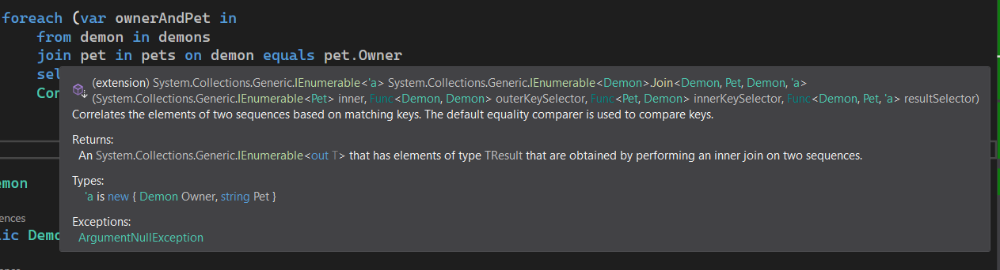
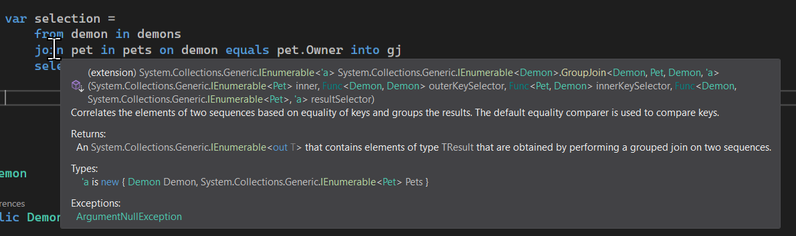

# C# 3 之查询表达式（十五）：`join`-`in`-`on`-`equals` 的底层原理

今天我们来说说最后一个 LINQ 查询表达式类型的对应底层原理：`join`。

`join` 是一种相当奇怪和复杂的处理语句。老实说如果我们一般只用 `from`、`let`、`where`、`select` 这些基本上就可以做得到和 `join` 一致的结果了，但是 `join` 仍然有一些不可替代的地方。下面我们来看看 `join` 的底层。

## Part 1 `Join` 方法组：实现 `join` 从句的核心

首先我们要说的是 `Join` 方法的系列方法组了。

### 1-1 `Join(序列, 原序列映射, 拼接序列映射, 最终的映射表达式)`

还记得我们之前的举例吗？我们之前用的是下弦鬼和宠物来举例的。首先，下弦鬼是一个列表，而宠物又是一个列表。不过，宠物列表里包含的信息里是包含下弦鬼的，是因为每一个宠物都有唯一的下弦鬼与之对应（当然宠物也可能没有被领回家）。

我们使用的就是 `join`。为了成功连接两个列表，我们使用了 `join`-`in`-`on`-`equals` 这四个关键字组合在一起的、迄今最复杂的从句类型。

```csharp
var selection =
    from demon in demons
    join pet in pets on demon equals pet.Owner
    select new { Owner = demon, Pet = pet.Name };
```

我们通过这样的筛选就得到了结果。

那么，它对应什么方法的执行呢？我们把鼠标放在 `join` 关键字（或者 `in`、`on`、`equals` 关键字都行）上面，可以看到这样的结果：



呃，这也太长了点，甚至还是四个泛型参数（喷血.gif

不过老实说，之前的 `Group` 方法也达到了这个级别，只是说我们平时因为使用惯用上了 C# 提供的泛型方法的类型推断机制，所以泛型参数甚至并不需要我们手写。这个方法也是一样。

我们抽取出主要成分，给大家看看这个方法究竟长啥样。

```csharp
var selection = demons.Join(
    pets,
    demon => demon,
    pet => pet.Owner,
    (demon, pet) => new { Owner = demon, Pet = pet.Name }
);
```

是的，四个参数。首先我们要知道，我们需要把那两个列表给连接起来，那么对于这个例子里，我们用到的是 `demons` 和 `pets`，那么我们连接的操作是 `pet` 追加到 `demon` 上。因此，我们把 `demons` 变量放在 `Join` 方法的前面当实例调用，而 `pets` 则当成第一个参数。这就表示连接。该方法的用法也是如此：我们要把 B 往 A 上去拼接、连接的话，我们是调用成 `A.Join(B, ...)` 的方式的。

接着，后面三个参数全部是 lambda 表达式。第二个参数很奇怪对吧，`demon => demon` 好像并没有映射改变什么啊。实际上，该参数的意思是，需要我们将写在 `Join` 方法前面的实例的每一项，经过什么形式进行转换得到的结果，然后才参与连接。显然，我们连接宠物是想要把宠物的主人名字和下弦鬼的名字匹配上，而下弦鬼在这个连接操作里并不会发生变动，因此 `demon => demon` 的意思就出来了：我们只希望映射期间迭代的元素直接作为连接的实例来参与相等性比较。

第三个参数是 `pet => pet.Owner`。这个就不用多说了。这个参数的意思是，将每一个写在第一个参数上的这个列表（`pets`）的每一个实例，都只取出 `Owner` 属性参与相等性判断。这一点和第二个参数的意思是类似的。

最后一个参数仍然是一个 lambda，不过这个 lambda 需要两个参数，分别对应了两个列表的每一个实例。我们这里取出 `demon` 和 `pet` 形式化表达一下，表示我期间参与循环的迭代变量。然后我们想要的是，我们在 `join` 之后，应如何映射一下结果。我们知道，`join` 从句是不能结尾的，因此它需要后面继续跟着一个 `select` 之类的从句来表达映射表达式。而这个 `select` 从句下的表达式的映射关系，就体现在我们翻译成 `Join` 方法的时候的这个参数上了。比如我们刚开始映射的语句是返回一个匿名类型的实例，然后把宠物和主人的信息给放进去，那么我们在使用 lambda 的时候，就对应如此即可。

这就是 `Join` 的用法，以及完整的对应关系了。

### 1-2 `Join` 还允许多传一个比较器对象

像是前文我们给出的 `Demon` 类型的实例，在我们使用 `equals` 来进行左右实例的比较的时候，我们大家都知道，等值连接是在查询表达式里无法定义出比较规则的。

按照查询表达式在我们早期介绍的信息里可以看出，相等判断用的是底层一个叫 `EqualityComparer<T>` 的泛型类型的实例来达到的。这个泛型类型 `T` 的实例会智能化判断你的这个类型 `T` 是否支持 `Equals` 和 `GetHashCode` 方法，以及如何实现相等性比较。正是因为这个原因，编译器才敢一劳永逸针对我们完全没有自己实现比较操作的实例来完成一种默认的、稍显合理的比较规则。

而如果我们需要手动规定比较规则，而又不去影响原来的数据类型的话，我们可以考虑使用相等性的比较器。那么我们的做法和之前介绍 `IEqualityComparer<T>` 的实现规则和使用方式完全相同，实现一个类型，从这个接口类型派生，然后实例化这个实例类型，当参数传入进去就可以了。

对于 `Join` 方法，我们也是允许的。我们只需要将这个实例类型的方法写到前文介绍的最后一个参数之后就可以了。是的，这就是 `Join` 方法的第二个重载方法：允许多一个参数表示相等性比较器的对象。

## Part 2 `GroupJoin` 方法组：实现 `join`-`into` 从句的核心

为了能够继续介绍 `join` 后面跟的 `into` 从句，我们之前引入了一个所谓的“分组连接”的概念。

看名字就看得出来：group 是分组的意思，join 在编程里是连接的意思，所以 group join 就是分组连接。我想，英语初心者可能会这么想，但如果学过专业知识甚至是专业英语的同学可能不会这么想，觉得太简单了。

答案是这样吗？分组连接的英语就是 grouped join。没有你们想象出来的那么奇怪和复杂。只不过，group 在这里是动词，而 join 也是。直接拿来放一起肯定不行，所以 group 要变个形。

当然，这里不是给大家扯英语的环节。下面我们来看看这个方法的用法。

先来回忆一下，分组连接的逻辑，我们之前用 `into` 的时候都怎么用的，为啥这么用，后面又跟什么东西匹配，然后怎么构成完整的查询表达式。

分组查询的核心是利用了 `join` 从句（或者我们刚才说到的等价的 `Join` 方法组）的“一对多”的关系。这个一对多在我们之前也有提到过。不过，在连接的操作里，一对多的关系对照起来表示的是，`from` 从句的是“一”，`join` 迭代的对象是“多”。我们拿之前的例子举例：

```csharp
var selection =
    from demon in demons
    join pet in pets on demon equals pet.Owner into gj
    select new { Demon = demon, Pets = gj };
```

在这里例子里，我们用到了一次 `into`。这个 `into` 表示的是，我在通过 `join` 和 `from` 的结合后，按照 `equals` 进行等值连接，得到的匹配项。不过，这里的 `gj` 变量是什么类型的呢？`IEnumerable<Pet>`。还记得吗？

这个 `gj` 为啥是这个类型的呢？因为我们从 `into` 断开，左边的是拼接操作，按照主人的实例来比较相等性。得到的结果，是按照连接拼接上去的，所以它会把所有的宠物的信息逐个匹配一次。我们知道这个例子里，一个宠物肯定只能拥有一个主人（或者还没着家），但肯定不会有两个及以上的主人。但是，一个下弦鬼肯定是可以一次性拥有多个宠物的，在这种关系上我们就是俗称的“一对多”。

而通过这样的规则得到了结果之后，`gj` 就得到的是，当前 `demon` 变量匹配的所有的宠物信息，所以是 `IEnumerable<Pet>` 类型。那么回到这个例子。我们思考一下。这个例子下，我们怎么写成方法的调用呢？



对照这个图片，我们可以得到 `GroupJoin` 方法的调用。哦豁，这个方法更复杂……不过好在，这个方法也只有一个带 `IEqualityComparer<>` 接口当参数的额外重载版本。

我们按照这个展示的图片展开查询表达式的写法，我们可以得到最终的结果：

```csharp
var selection = demons.GroupJoin(
    pets,
    demon => demon,
    pet => pet.Owner,
    (demon, gj) => new { Demon = demon, Pets = gj }
);
```

对的。它和 `Join` 唯一的区别只差在最后一个 lambda 的第二个参数上。原本的参数是 `pet`，现在因为得到了一对多的结果之后，这里的变量就从原来的 `pet` 改成了 `gj` 了。

用法也和之前说过的迭代方式一样。那么我们这个就说完了。另外一个重载可以参照 Part 1 的用法带上去就可以了，也没有啥特别大的区别。

## Part 3 总结

是的，至此我们就把查询表达式的基本用法以及编译器的实现原理给大家说明白了。实际上可以看出，实现原理也就是把关键字按照一定的规则改造成了方法调用罢了，也没有什么好稀奇的。但是，这种改造使得我们更习惯使用关键字来书写查询表达式，因为方便还好用，这就是 LINQ 体系里非常有趣的一点。

下一讲我们将给大家找一些练习题给大家做，作为阶段练习。