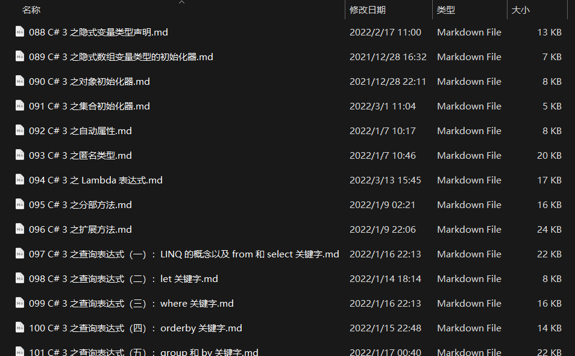

# C# 3 之查询表达式（十六）：LINQ 阶段性练习（二）

今天咱们来完成阶段练习。阶段练习在之前已经做过一次了，不过用的是关键字的查询表达式写法。

这次我们确实也没啥好说和好验证测试的，不过我们还额外学习了一些方法，比如聚合函数以及关系代数的相关运算。这次我们就来做一些题目，当然，可能一些题目不会考察这些知识点，只是想看你灵活使用 LINQ 的程度。

上题。

## 题目 1

给定一个序列 `int[] array`，由一些可能相同也可以不同的整数构成。请写出查询表达式或 LINQ 的相关方法查询获取这个数字所有数字出现的频次。所谓的频次就是出现的次数的一个总结表，比如数组里有两个 1，那么查询结果里必须包含这个数字 1 有两次的信息。

答案：

```csharp
var selection = array
    .GroupBy(x => x)
    .Select(g => new { Value = g.Key, Count = g.Count() });
```

## 题目 2

给定一个字符串 `string s`，请删除该字符串里的所有 `'a'` 字符。注意，因为查询表达式的结果是返回新对象，因此我们无需从字符串里改变结果。

答案：

```csharp
var selection = new string(s.Where(c => c != 'a').ToArray());
```

## 题目 3

统计一个数组 `int[] array` 里每一个元素的和。

答案：

```csharp
int result = array.Sum();
```

## 题目 4

拼接一系列字符串构成的字符串数组 `string[] strings`。不能使用 `string` 类型里给出的方法来完成。

答案：

```csharp
string result = strings.Aggregate(string.Empty, (interim, next) => interim + next);
```

## 题目 5

迭代所有 7 和 7 的倍数。

答案 1：

```csharp
var selection = Enumerable.Range(0, int.MaxValue).Where(number => number % 7 == 0);
```

答案 2：

```csharp
var selection = Enumerable.Range(0, int.MaxValue).Where((_, i) => (i + 1) % 7 == 0);
```

## 题目 6

假设一个类型 `Student` 里只包含学生名（`Name` 属性，`string` 类型）、语数外三科成绩（`Chinese`、`English`、`Math` 属性，且均为 `int` 类型），请找出三科都有成绩的学生的名字。比如说，有学生作弊或者没有参加考试导致某学科甚至三个学科都为 0 分。我们需要找的是没有旷考并且没有作弊得到有成绩结果的学生，而且还得是三科全都有成绩的学生。

答案 1：

```csharp
var selection = students
    .Where(s => s.Chinese > 0 && s.English > 0 && s.Math > 0)
    .Select(s => s.Name);
```

答案 2：

```csharp
var selection = students
    .Where(s => s.Chinese * s.English * s.Math != 0)
    .Select(s => s.Name);
```

答案 3：

```csharp
var selection = students
    .Where(s => new[] { s.Chinese, s.Math, s.English }.All(v => v > 0))
    .Select(s => s.Name);
```

## 题目 7

作者将整个 C# 教程的文档全部备份放在了本地路径在一个叫 `Tutorial` 的文件夹里。假设它位于 `P:\Tutorial`。



名字的格式我都固定为“三位数字（表示讲数）+讲解的内容的名字.md”。现在我想让你找到所有关于 LINQ 的文件的对应讲数（就前面那个三位数就是对应的讲数）。

答案：

```csharp
using System.Linq;
using System.IO;
using System.Text.RegularExpressions;

int discard;
var regex = new Regex(@"(\d{3})\s*C#\s*3\s*之查询表达式(?=（[一二三四五六七八九十]+）：)");

var fileNames = 
    from fileInfo in new DirectoryInfo(@"P:\Tutorial").GetFiles()
    let fileName = fileInfo.Name
    where Path.GetExtension(fileName) == ".md"
    let fileWithoutExtension = Path.GetFileNameWithoutExtension(fileName)
    let match = regex.Match(fileWithoutExtension)
    where match.Success && match.Groups.Count >= 2
    let matchedValue = match.Groups[1].Value
    where int.TryParse(matchedValue, out discard)
    let integer = int.Parse(matchedValue)
    select integer;
```

本题目需要你至少熟悉文件操作，以及正则表达式。本教程对 API 的内容并不会作过多介绍，因为是语法教程。不过，如果我有空的话，我会出单独的教程视频或者文章给大家专门介绍这些专门的 API 的用法和操作。

如果你会这些 API 的话，你可以试着去了解一下这个题目的具体的查询表达式的书写，每一个从句都是什么意思。大概思路就是，先获取文件夹的信息，然后迭代这个文件夹的所有文件。接着，由于迭代的变量是 `FileInfo` 类型，里面有一个 `Name` 是这个文件的文件名。我们需要取出该文件名，然后参与比较和判别。正则表达式的作用就是为了去契合判断和排除掉不满足命名规则的文件。首先我们要求文件必须是 `.md` 的后缀名，所以不是的可以排除掉（第 11 行代码）；然后去看文件的文件名是否按规范取名（规范是三个数字，外带“C# 3 之查询表达式”，然后后面跟着编号表示整个板块的第几讲，然后是冒号，最后是一些额外的说明文字）。我们只需要找到规范标准的部分（三个数字，然后知道 LINQ 的命名文件一定是“C# 3 之查询表达式”，然后后面随意，所以我们按照这个规则去写正则表达式进行匹配就可以了。

如果文件匹配失败，那么我们就不去管这个文件了，因为它不是我们需要的文件（第 14 行）。注意第 14 行还有一个额外的判断：`match.Groups.Count >= 2`。这是正则表达式匹配期间需要的额外规则：因为我们想要取出这个三位数，因此正则表达式允许我们取出自定义的信息，做法是给需要取出的信息用小括号括起来，所以这里的正则表达式的最开头的 `\d{3}` 要括起来。

括起来之后，我们在取值得到的结果里（`Groups` 属性里）就有我们需要的结果了。注意，`Groups` 默认匹配成功会至少带有一个元素，就是这个匹配成功的字符串本身；如果要取出自定义的括号的内容，是从索引为 1 开始的部分来取值的，所以我们这里要求至少 `Groups` 在匹配成功之后包含两项元素，因为 `[1]` 才是我们需要的内容。

最后，我们取出这个三位数，尝试去将其解析为 `int` 类型。早就说过 `string` 转 `int` 是没办法直接转的，需要我们使用解析的相关方法来完成。这里使用 `TryParse` 方法可以保证和验证我们是否可以将结果正常解析为 `int` 数值。该方法带有一个 `out` 参数。该参数我们是无法在查询表达式里使用的。因为查询表达式最终会被翻译成一个个的方法调用，以及 lambda。而 lambda 里的变量的可访问范围只在 lambda 环境里才能用。我这里定义的 `out` 参数实际上也只能在当前的这个 lambda 范畴里使用。因此，我们无法在后续的比如 `let` 从句甚至是 `select` 从句里使用这个从句里定义的 `out` 参数结果。

于是，我们在查询表达式的外部定义一个完全无意义的临时变量 `discard` 来接收该不使用的 `out` 参数，保证语法的正确性。这种操作很骚，但是也很严谨正确，希望你能够学会。

最后，如果 `TryParse` 方法返回 `true`，那么就说明这个三位数可以成功解析为 `int` 结果，那么我们就调用 `Parse` 方法将其真正意义上转为整数结果，然后得到的 `integer` 结果直接返回出去就可以了。至此，这个查询表达式就结束了。

呃，稍微啰嗦一下。

注意，lambda 里定义的变量不能在别的地方用，但是反之不然。lambda 可以捕获外部变量，这意味着你可以“单向”从外往里传输数值和数据；但你不能反过来。这是 lambda 和匿名函数的基本规约。刚才我们使用了 `discard` 变量来接收这个不需要的结果，实际上在后续我们仍可以使用 `discard` 变量，因为这个变量此时是写在两个 lambda 的外面的，从语法上说，你是可以在后面的 `select` 和 `let` 从句里使用它的，但是，这不是真正意义上的正确的用法。因为我们再三说明，查询表达式等价于方法调用的模型，所以里面传入的参数是一个一个的 lambda 表达式。这些 lambda 表达式的执行先后顺序并不是真正意义上的先谁后谁，因为 lambda 本身就有延迟推迟被调用的效果，所以我们拿不准该结果的真正意义上的正确，所以这种用法并不是很合理。

不过你非要这么用的话，你会收到一个编译器错误，告诉你 `discard` 变量并没有得到赋值。不过，你可以试着给它一个没有意义的初始值，然后试着运行一下程序来看结果。

我们来试试一个稍微简单一点的例子吧：

```csharp
int discard = default(int);

string[] series = new[] { "123", "456" };
var selection = series
    .Where(e => int.TryParse(e, out discard))
    .Select(_ => discard);

foreach (int v in selection)
    Console.WriteLine(v);
```

注意此时的 `Select` 方法里，我们的参数是没有用到的，而是直接把这里的 `discard` 给拿出去了。

运行程序，实际上是可以得到正确的结果的。原因是，在整个 lambda 使用环境里，因为 `discard` 为捕获变量，因此它会被放进闭包里，就是我们之前说的生成的额外的嵌套类类型里当字段。所以，所有使用到的这个捕获变量，全都会被看成是在使用这个嵌套类里的这个字段。所以，上下使用的 `discard` 其实也还是同一个 `discard` 变量，不会有错。

但是，我们从来也强烈不建议各位这么用。因为它不是很好理解清楚，而且理解错误会造成很可怕的后果，所以我们不建议你这么写代码。

至此，我们就把阶段练习给结束了。之后我们再给大家安排两讲关于 LINQ 和表达式树的内容，那么就可以完结 LINQ 了。