# C# 3 之查询表达式（十七）：表达式树和动态查询

今天我们来看一个新的知识点：**表达式树**（Expression Tree）。表达式树对于一些高性能的场景下会比较实用；不过，因为它的知识点会用到和结合到 LINQ，所以本特性我们归纳在查询表达式里介绍，这也是 C# 3 里的最后一个新语法特性。

> 本讲内容难度较大，虽然还没有达到完全理论的、Lambda 和匿名函数递归的难度，但是也比较困难，理解上来说是有一些复杂的。好在平时写代码用得不是特别多，因此可以跳过这一讲的内容。如果你需要用到它们，可以再回来看。

## Part 1 `IQueryable<>` 接口简介

在之前的内容里，我们介绍了 `IEnumerable<>`、`IOrderedEnumerable<>` 和 `IGrouping<,>` 三种接口的用法，以及都对应什么意思。它们表示的是一个待迭代的序列。这个序列可以是有限的，也可以是无限的。只要运用灵活和严谨，无限的迭代序列也是可以的。

而 `IOrderedEnumerable<>` 接口则对应的是 `orderby` 从句（或 `OrderBy`、`OrderByDescending`、`ThenBy` 和 `ThenByDescending` 四个方法）。这些方法因为执行起来是为了优化性能，所以所有的排序依据会因为这些方法逐个追加、添加到底层的排序依据列表里去，等待合适的时候才会一口气调用和执行。正是因为这些原因，所以只用 `IEnumerable<>` 接口因为是定死了的数据类型，所以做不到这一点。因此，排序操作有了一个单独的接口。你可以认为，它包含排序依据，但也支持迭代，所以 `IOrderedEnumerable<>` 接口从 `IEnumerable<>` 派生，是这么一个关系。

而 `IGrouping<,>` 接口则对应的是 `group`-`by` 从句（或 `GroupBy` 方法）。该方法动用了分组依据，但它和前文的排序依据不同，分组依据是唯一的，所以只能定义一个分组依据，所以它不具备前面还需要累计排序依据的效果。不过，因为分组依据会带有分组的结果，因此 `IEnumerable<>` 接口也无法做到，它没有支持这个分组依据的属性或别的成员，因此只能单独创建出一个类型。而 `IGrouping<,>` 属于是一个一对多的关系列表，因此它仍然也支持迭代，所以它也从 `IEnumerable<>` 接口派生。

今天我们要说一种新接口类型：`IQueryable<>`。该接口和前面的 `IOrderedEnumerable<>` 和 `IGrouping<,>` 不同的地方在于，`IQueryable<>` 接口不是一个单独的某种查询从句导致和产生的结果。它是什么呢？我们将稍后说到，下面我们卖个关子，先说说一个神奇的概念：**表达式树**（Expression Tree）。

## Part 2 表达式树：~~米饭是菜~~代码是数据

有没有想过一个问题。我们之前 C# 的灵活程度允许了我们将整数小数等数值（包括字符串啊字符这些）存储起来，而学习到了委托之后，我们发现，方法也能存储起来了。

那么，有没有更高级的存储模式呢？有的，存储代码。这是个什么概念呢？你想想，我如果连代码的逻辑也能抽象出来存储到变量里去，这是不是有些科幻了？表达式树就是这么一种思维，它允许你甚至把你想要的操作模型拆解成一个一个的小部分，然后组装起来存储起来，也可以只存储这些小部分。这就是表达式树的基本思想。

### 2-1 引例 1：表达式树求 1 加 2 的和

先来看最基础的例子，求 1 + 2 的结果。当然，大家都知道是 3，不过我们这里不是教各位计算的，这里是给大家说明，如何去使用表达式树。

我们先思考，1 + 2 是什么。1 + 2 是一个表达式，它利用到了加法运算。加法运算是一个**二元运算**（Binary Operation），换句话说就是，加号运算符是双目运算符，就这个意思。加法计算既然需要两个数进行计算，按照数学的思维，我们是在加号的左右两侧匹配上一个数字信息，然后写到加号的两侧，最终表达出来的结果就是两个数的和了。

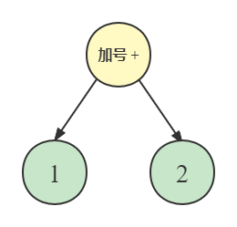

是的，我们可以抽取出来这种抽象的逻辑。我们知道，C# 编程语言怎么搞，语法再复杂，底层也是进行的各种操作和运算。我们只需要把这些运算抽象成上面这样，就可以得到我们应该有的结果。当然，单目运算（一元运算）也就是把下面的 1 和 2 两个部件删掉一个，三目运算（三元运算）则是把下面的部分再追加一个部件上去。更加复杂的话，就是往这个 1 和 2 上递归地套用这些运算过程。这就很像是你学的英语语法，主句加从句，从句里可能还会有别的主从句关系，就是这么个意思。

表达式树的逻辑就是，我们把这些运算符按照上述图片给出的模型来存储起来即可。那么，怎么写代码来完成呢？这就需要我们先用到 `Expression` 类型了。该类型是一个抽象类，而且还是一个工厂类型。这个类型可以搭配里面的方法来构建出一个表达式的抽象表达出来，然后按变量的形式存储起来。

```csharp
var firstValue = Expression.Constant(1);
var secondValue = Expression.Constant(2);
var addOperation = Expression.Add(firstValue, secondValue);

Console.WriteLine(addOperation); // Output the raw expression.
```

当然，你熟练了的话，因为它们都是变量的关系，你完全可以内联放进 `addOperation` 变量的执行方法的参数里去。

```csharp
var addOperation = Expression.Add(
    Expression.Constant(1),
    Expression.Constant(2)
);
```

我们仔细来看。`Add` 方法是一个方法，它带有两个参数，对应了我们上方给出的这个加号下面引用的两个数值 1 和 2；而 1 和 2 是一个数，而我们这里是把 1 和 2 当成了存储的东西，因此不能直接写 1 和 2，而是把这个 1 和 2 呢，用 `Expression.Constant` 方法给包裹起来。这个 `Expression.Constant` 方法就是包裹一个常量进去。它传入一个参数，将常量数值转换为一个可存储的表达式。这里的 1 和 2 会被编程视为是“常量表达式”，它也是表达式的一种，只不过它没有别的分支，只有一个数字的节点而已。

接着，我们有了两个常量表达式之后，我们就需要完成加法操作，把它们俩给关联起来。关联的方法则是调用 `Add` 方法。这个方法专门用来计算两个表达式的加法。于是，我们用法就是，把刚才的两个 `Constant` 方法调用的结果给传入进去，然后作为这个 `Add` 方法的参数。于是乎，该 `Add` 方法得到的结果就是，加法运算的结果表达式。是的，它得到的结果仍然是一个表达式，而不是结果数值。因为我们在本文介绍的内容上来说，它存储的就是一个一个的表达式，而并不是结果。

那么，我们使用 `Console.WriteLine` 方法会得到什么结果呢？我们来试试看：

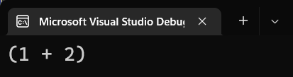

我们看到了一个括号包裹的表达式：1 + 2，这就是整个表达式树做基本的样貌和用法。

至于怎么去获取其中的结果（即这个表达式的结果 3），我们稍后来说。

### 2-2 如果我记不住这些方法名字怎么办？

呃，这个只需要你去查资料和看元数据就可以了。你完全不必去记住它们。我再三强调，我们是学习知识，不是应付考试。这些东西不需要你全都记住，到时候查找就可以了。

另外，如果你稍微会一丢丢的英语也不至于猜不到结果。比如说，我如果要完成减法，那么用的方法名就可以是 minus、subtract 这类型的词语表示减法。实际上，表达式树里用到的是 `Expression.Subtract` 方法，用的是 subtract 这个单词。因此，你猜都猜得到这些结果，甚至不必自己去背。

因此，不要随时随地都死记硬背。

### 2-3 如果表达式再复杂一些，怎么做？

我刚才说到了，表达式用的是嵌套的思维。如果我有个比如说 3 + 2 - 5 的表达式的话，要去存储的话，我们会按照数学运算的优先级，先确定是 3 + 2 作为第一步运算结果，然后再把结果再减 5，得到最终的结果，于是：

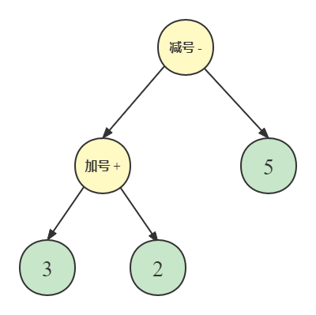

是的，这里有一点奇怪的是，如果你第一次接触语义分析的话，可能很难去理解为啥一个减号直接和一个加号连起来了。实际上，这里的箭头并不是我们真正意义上的传递的过程，它只是表示我这里有两个分支。其中，下面的 3 和 2 同时由一个加号的节点连下来，因此下面的这个模块是一个表达式。

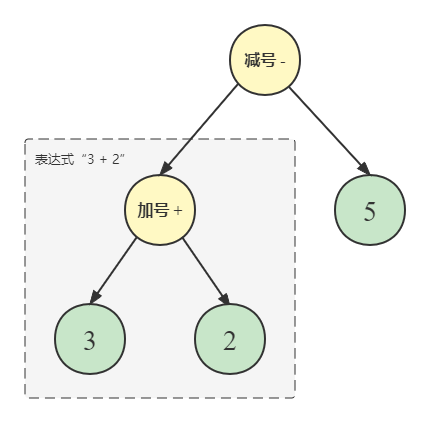

所以，整个这种分支关系，我们能够看成整体的就把它看成整体，整体是表达式之后，你再来看这个完整的图就很好理解了：它是在对两个表达式进行减法运算，左侧的表达式是我们的被减数，只不过此时被减数也是一个表达式，是这个表达式的结果才能作为被减数的结果来用；而右边的 5 是充当减数的角色。

那么，写成表达式树的代码的话，是这样的：

```csharp
var finalOperation = Expression.Subtract(
    Expression.Add(
        Expression.Constant(3),
        Expression.Constant(2)
    ),
    Expression.Constant(5)
);

Console.WriteLine(finalOperation);
```

来看下运行结果吧：

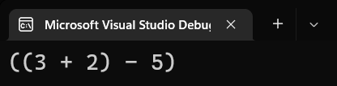

打括号也就是为了你能够看清楚分清楚调用逻辑和表达式的关系。

如果还有更复杂的处理的话，这个就需要你自己想了，大概就是反复进行嵌套调用，这种思路。

### 2-4 引例 2：表达式树赋值无参 lambda 表达式

表达式树不仅可以只操作一个数学表达式，它也可以操作一个 lambda 表达式。Lambda 表达式我们已经再熟悉不过了，它的出现是为了接替匿名函数，称为最好用的、内联使用的、无方法名的方法。

那么，如果要完成一个方法改造成表达式的逻辑的话，我们的办法就是采用一个叫 `Expression.Lambda` 方法来完成。

假设，我们想要将返回 3 + 2 的表达式一个 lambda 表达式给作为表达式树的赋值，那么我们怎么做呢？首先我们要了解，lambda 和普通表达式的区别。

Lambda 表达式多了一坨参数。Lambda 右边赋值的是一个表达式结果（当然也可以是一个大括号包裹的多个语句）。由于表达式树的限制，我们只可以操作单个返回表达式的 lambda 表达式。因为表达式树的发明是为了辅佐查询表达式的，而查询表达式的逐个执行步骤（你回忆一下，查询表达式的每一个从句），是不是都是只带一个基本的、简单的表达式处理过程？

而由于这种限制，貌似我们对表达式树写起来更加方便一些了，因为我们可以按照规则进行一步一步地拆分得到这些过程，完全不必去考虑如果多个语句怎么去写代码的问题。

回到这里。我们要想把 `() => 3 + 2` 翻译成表达式树，怎么做呢？首先，因为该 lambda 表达式没有参数，只有一个返回值，因此我们可以试着把表达式 3 + 2 构造起来，这个前面的内容里已经给出了；而这个 `() =>` 的部件怎么去体现呢？

实际上，前文说到的 `Expression.Lambda` 已经给出了答案。你只需要把表达式赋值到这个方法里当参数，然后给出对应的 lambda 表达式的兼容委托类型即可：

```csharp
var finalOperation = Expression.Lambda<Func<int>>(
    Expression.Add(
        Expression.Constant(3),
        Expression.Constant(2)
    )
);
```

内层（第 2 到第 5 行代码）构造的是 3 + 2 的表达式，而我们只需要直接将结果传递到里面去即可。

我们来看这个表达式，然后直接使用输出语句得到的结果吧：


可以看到，这个表达式还是很清晰的。这就是这个处理方式。

### 2-5 引例 3：表达式树赋值带参数的 lambda 表达式

那么，如果 lambda 带有参数的话，怎么办呢？比如说 `(x, y) => x + y` 的表达式，我们要怎么去做呢？这次，我们需要用 `Expression.Lambda` 的另外一个重载版本：这次我们需要传入两个参数。

首先，我们要定义两个参数的表达式树的实体类型，这里我们用到的方法是 `Expression.Parameter`。该方法要求传入两个参数，一个是参数类型，另外一个是参数名称：

```csharp
var firstArg = Expression.Parameter(typeof(int), "x");
var secondArg = Expression.Parameter(typeof(int), "y");
```

很好理解，对吧。接着，我们将它们传入到 `Expression.Lambda` 里去当参数。这一次，由于我们带有~~新鲜~~额外的参数，因此我们这次传入的这个 `Expression.Lambda` 也有所不同。此时我们需要为这个重载版本传入两个参数。第一个参数是 lambda 表达式本来应该执行返回的表达式，那么，由于本例子里是“参数 + 参数”，也就是这里所说的 `x` 和 `y` 的和，因此我们直接使用如此操作给它们加起来：

```csharp
var adding = Expression.Add(firstArg, secondArg);
```

接着，我们将该结果当成第一个参数传入到 `Expression.Lambda` 里去；另外，第二个参数呢？第二个参数这里我们传入的就是这些参数本身了。如果没有参数直接加起来肯定是不合理的操作，于是我们要带入两个参数进去。

```csharp
var args = new[] { firstArg, secondArg };
```

最后，我们将它们一并传入进方法之中：

```csharp
var firstArg = Expression.Parameter(typeof(int), "x");
var secondArg = Expression.Parameter(typeof(int), "y");
var finalOperation = Expression.Lambda<Func<int, int, int>>(adding, args);
```

请一定注意这一次我们的 lambda 有两个参数和一个返回值，因此我们写的时候，`Expression.Lambda` 的泛型参数上兼容的类型就应该是 `Func<int, int, int>`。

来看下结果吧：

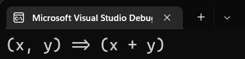

带参数的 lambda 表达式就是如此搞定的。

### 2-6 引例 4：lambda 可以直接赋值给表达式树的部件

实际上，上述的 lambda 表达式有些复杂，因此 C# 允许我们直接将 lambda 传入进去。于是，原本很长的赋值过程，可以简化成一个 lambda 直接赋值的操作。

先别急。为了能够吃透赋值的原理，我们这里需要先看看这个 `finalOperation` 的类型才行。把鼠标放到这个最终表达式的变量上去：

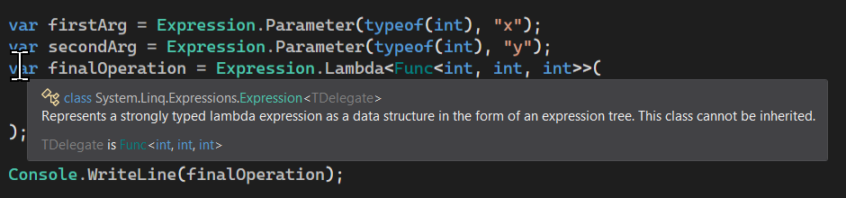

我们可以看到，它的类型其实是 `Expression<Func<int, int, int>>`。我们之前教过大家如何看长泛型名称。`Expression<Func<int, int, int>>` 要从内往外理解。先看到内层，我们可以看到 `Func<int, int, int>` 的结果，它表示两个 `int` 参数和一个 `int` 类型返回值的委托类型；而外侧就是套了一个 `Expression<该委托类型>` 的壳子罢了。所以这个长泛型名称的意思是，表示如此委托类型的表达式树的部件。而这里的 `Expression<>` 类型的名字 `Expression`，实际上是代表了可以包裹任何一个 lambda 表达式的表达式树的部件。而如果把类型名称取名叫 `LambdaExpression<>` 就显得有些啰嗦了，所以就省去了前面的 lambda 这个单词前缀。

那么，此时我们删除掉多余的部件，只保留一个 lambda 表达式，并且显式给出变量的返回值类型：

```csharp
Expression<Func<int, int, int>> finalOperation = (x, y) => x + y;
```

这样一句话就可以了。是不是很方便？C# 甚至连这样的 lambda 的赋值过程都可以帮我们自动处理，是不是很秀~

我们再次打开程序运行起来，可以看到结果和原来写了一大堆的赋值是完全一样的：

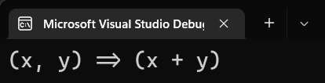

### 2-7 引例 5：带 .NET 库里的 API 的表达式树的写法

假设，我们将前文的简易操作改成方法调用的话，这怎么做呢？比如说，我们要比较两个字符串，其中第一个字符串是 `x`，第二个字符串是 `y`，那么它们的比较操作就是 `x == y` 或者是 `x.Equals(y)` 了。

假如我们这次用一下 `Equals` 方法的调用过程的话，那么这个操作应该如何去做到呢？

我们照旧使用前面一节的办法——lambda 的 C# 语法糖，直接把 lambda 赋值给一个。

```csharp
Expression<Func<string, string, bool>> expression = (x, y) => x.Equals(y);
```

我的天，这也太方便了点吧！C# 的编译器甚至连这样的操作都可以直接帮我们去处理掉，C# 的编译器 yyds！

这个方法的原本操作就比较麻烦了，因此本小节内容就不给大家介绍它的完整版实现方式了。

## Part 3 `AsQueryable` 方法

前文我们说了这么多的处理机制，下面我们也应该说一些契合 LINQ 的内容了。

先来说说 `IQueryable<>` 接口。我们查看该接口的元数据可以发现，它里面啥玩意儿没有，但走了 `IEnumerable` 接口派生，并且也走了一个没有带泛型参数的 `IQueryable` 接口派生。

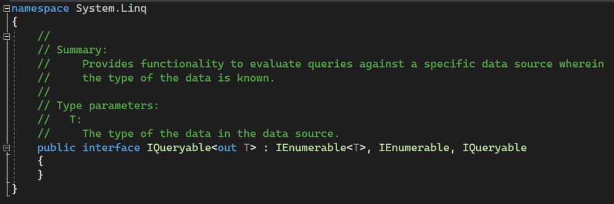

而我们再次打开 `IQueryable` 无泛型参数的接口的元数据可以发现：

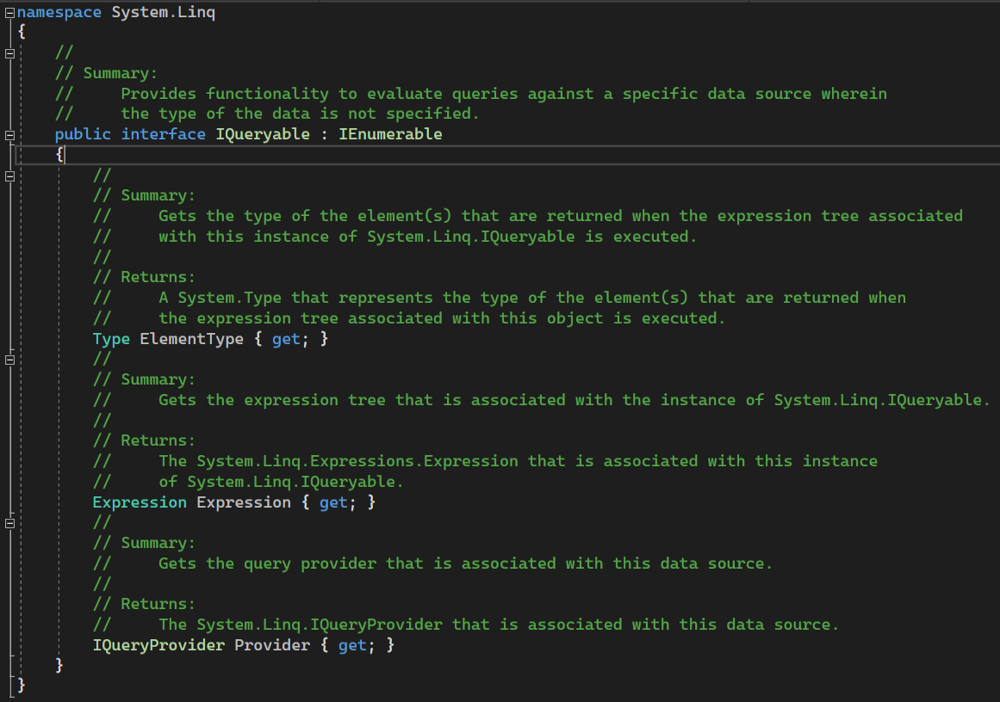

它里面就只带有三个属性：`ElementType`、`Expression` 以及 `Provider`。这三个属性大概给大家说说是什么。

```csharp
public interface IQueryable : IEnumerable
{
    Type ElementType { get; }
    Expression Expression { get; }
    IQueryProvider Provider { get; }
}
```

第一个属性 `ElementType` 的意思是，我们用于最终迭代的序列，它的元素的类型是什么。

第二个属性 `Expression` 就是当前查询的表达式了。比如这个查询机制里面就代指这个完整的 LINQ 查询表达式。虽然我们知道这个查询表达式特别复杂，带有 `where` 从句和 `select` 从句，但实际上在底层也会被处理为一个完整的表达式树的实体。

第三个属性 `Provider` 为其提供基本的转换，即如何把一个查询过程转换为一个迭代对象，或者反过来，即如何将一个迭代对象搞成一个查询过程存储起来。它里面带有四个方法，分别是两个 `CreateQuery` 的方法重载，和两个 `Execute` 的方法重载。其中 `CreateQuery` 就是把序列转换转为查询存储过程的表达式树的实体的对象；而 `Execute` 就是专门执行查询过程。

从设计来说，第三个属性已经被完整实现好了，而它也在底层使用，因此我们并不需要去管它。我们需要做到的，就只是去迭代序列而已。做法其实很简单，直接 `foreach` 即可。

```csharp
int[] array = { 3, 8, 1, 6, 5, 4, 7, 2, 9 };
var queryableSelection = (
    from element in array
    where element % 2 == 1
    select element * 3
).AsQueryable();

foreach (int element in queryableSelection)
    Console.WriteLine(element);
```

结果也是完全可以得到的，只不过你可能会在运行期间看到它的速度会比普通的迭代过程要慢上一些：

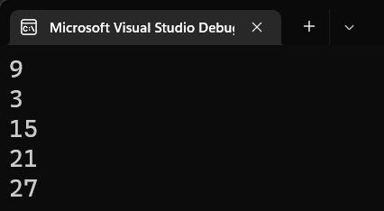

为什么运行的时候，迭代过程是逐步而且缓慢的呢？因为它的底层是将我们的每一个迭代过程都存储起来了，因此操作是逐步进行的，所以才会这样。

## Part 4 动态查询

下面我们来说说表达式树和动态查询的关联和用法。先来说说动态查询的概念吧。

### 4-1 动态查询的概念

我们来看看 B 站的番剧查询页面。


在右侧我们可以发现各种各样的条件设置，提供给用户自己查询。右侧可以查询番剧的类型、配音是国配还是日配、地区是国漫还是日漫还是别的国家的漫画、番剧的发布时间是什么时候，以及番剧的具体类型。

这么多条件不可能人人全都会选择，我们只会逐步选择其中一些，或者我们只会选择其中的一部分作为搜索选项。我们就把条件并不是固定的，而是通过用户控制而逐步添加的查询规则称为**动态查询**（Dynamic Query）。

我们不来做这么复杂的，为了大家初步了解动态查询，我们简单给大家介绍一些基本的查询规则的叠加替换就足够了。

### 4-2 理解代码

假设我们仍然是查找番剧的具体情况，那么我们可能会用到里面的一些条件，比如查询番剧的名字带有什么词语之类的。会编程的你自然会想到，用户输入一个名字的部件，然后程序可以使用字符串的 `Contains` 方法来完成匹配，看看哪些番剧都包含了这个输入的内容。另外，我们还会有番剧是哪个国家的，这些条件。

那么，做法是这样的。假如我们给一个叫做番剧创建一个对象类型：

```csharp
class Bangumi
{
	public string Name { get; set; }
	public string Country { get; set; }
	public DateOnly Date { get; set; }
	public Season Season { get { return (Season)(Date.Month / 4); } }
}

enum Season { Spring, Summer, Autumn, Winter }
```

分别的四个属性是番剧名字、番剧的国家、番剧的发布日期以及番剧是哪个季节的番剧。

> 这里简单做一个科普。日漫番剧只分 1、4、7、10 月份的四种日期的新番，因为日本的番剧一般是一个季度一个季度的发布进度。正是因为这个原因，一周一集的番剧在一个季度里最多可以发布到 13 集，最少也有 11 集，所以这就是为什么日漫的一个番剧有些只有这么多的集数。
>
> 这里我们规划的 `Season` 枚举类型匹配上对应的 1、4、7、10 月番，不过我们用的是春、夏、秋、冬四个季节来代替它们各自的英文名 January、April、July 和 October，写这些的话，不好记也比较长。

我们直接来看代码吧。

```csharp
using System;
using System.Linq;
using System.Linq.Expressions;
using BangumiPredicate = System.Linq.Expressions.Expression<System.Func<Bangumi, bool>>;

class Program
{
    static void Main()
    {
        // 创建一个待判断的番剧集合，一会儿用来检索各个条件用。
        // 这里是举例子所以啥也没有写。
        var bangumis = new Bangumi[] { };

        // 定义默认条件。这个条件作为一个占位符使用。如果用户任何条件都不判断的话，会默认无条件取出该番剧。
        BangumiPredicate predicate = bangumi => true;

        // 判断名称。
        Console.WriteLine("请输入你所记得的番剧的名称，可以是番剧完整名字也可以是其中一部分（不想按此条件查询，可以输入下划线“_”代替）：");
        string bangumiName = Console.ReadLine();
        if (bangumiName != "_")
            predicate = predicate.And(bangumi => bangumi.Name.Contains(bangumiName));

        // 判断国家。
        Console.WriteLine("请输入你所记得的番剧的国家（不想按此条件查询，可以输入下划线“_”代替）：");
        string countryName = Console.ReadLine();
        if (countryName != "_")
            predicate = predicate.And(bangumi => bangumi.Country == countryName);

        // 判断日期或月份，以及季节。
        // 输入不了季节，就让用户输入月份来完成。如果记不住的话，就按照 1、4、7、10 来填写就行了。
        // 如果连季节都记不住就不写月份，只写年份即可。
        Console.WriteLine("请输入你所记得的番剧的番剧年份月份，可以只有年份，也可以年月都输入，用斜杠分开（不想按此条件查询，可以输入下划线“_”代替）：");
        string rawDateValue = Console.ReadLine();
        bool inputContainsMonthValue = rawDateValue.Contains('/');
        rawDateValue = inputContainsMonthValue
            ? string.Format("{0}/01", rawDateValue) // 包含月份，就只需要关心日期。
            : string.Format("{0}/01/01", rawDateValue); // 不包含月份，那么需要默认为月份和日期置为 1 月以及 1 号。
        DateOnly dateValue;
        if (DateOnly.TryParse(rawDateValue, out dateValue))
            predicate.And(
                bangumi =>
                    bangumi.Date.Year == dateValue.Year
                        && inputContainsMonthValue
                        && Enum.Parse<Season>((dateValue.Month / 3 * 3 + 1).ToString()) == bangumi.Season
            );

        // 创建构造出来的查询对象。
        var query = bangumis.AsQueryable().Where(predicate);

        // 迭代查询结果。
        foreach (var element in query)
            Console.WriteLine(element);
    }
}

static class Extensions
{
    public static BangumiPredicate And(this BangumiPredicate @this, BangumiPredicate another)
    {
        return @this.Update(
            Expression.AndAlso(@this.Body, another.Body),
            @this.Parameters
        );
    }
}
```

### 4-3 扩展方法 `And`

因为内容太多了，还是写中文注释吧。写英语注释有点看着费力。先来说说最下面的这段代码。最后面这个代码是用来拼接两个表达式树的条件部分的。`Update` 方法用来更新查询期间的 lambda 表达式的返回部分代码。因为我们是想执行取出过程，因此我们每一个 lambda 表达式的参数并没有改变，但改变了的是返回结果。比如说，我有条件 A，那么新加入的条件 B 就和 A 应该是逻辑与的关系，那么两个 lambda 表达式本来分别为

* `(bangumi) => a`
* `(bangumi) => b`

现在我们更新后，需要改成

* `(bangumi) => a && b`

这个道理，即参数仍然不变动，只是需要我们把两个条件给逻辑与起来，因此写的时候，用到的是 `Update` 方法，并且使用到 `AndAlso` 来完成逻辑与的拼接过程。注意是 `AndAlso`，因为在名称取名的时候，`And` 被视为位与运算了，因此这里用别的名字代替了一下。

接着，我们回到上面来看逐个代码。我们说一个就行了，剩下的俩可以自己看懂的。

来说说第一个吧。

### 4-4 第一个判断逻辑：判断番剧名称

```csharp
// 判断名称。
Console.WriteLine("请输入你所记得的番剧的名称，可以是番剧完整名字也可以是其中一部分（不想按此条件查询，可以输入下划线“_”代替）：");
string bangumiName = Console.ReadLine();
if (bangumiName != "_")
    predicate = predicate.And(bangumi => bangumi.Name.Contains(bangumiName));
```

首先，程序会打出一行文字提示用户输入你要检索的番剧的名称。名称可以是全名，也可以是名字的一部分。如果不想按这个条件搜索的话，可以输入下划线 `_` 跳过。

那么，下一行代码就会开始执行读取。读取后是一个字符串，正好是我们需要的内容。接着，我们拿出这个字符串来判断看它是不是下划线。如果是的话，就说明用户不想判断这个条件，于是我们就跳过 `if` 的条件；否则就执行里面的语句。

里面的语句实际上是一个更新过程。做法就是把原始的 `predicate` 条件和新条件给拼起来。拼起来的操作是用的我们最后面实现的这个扩展方法 `And` 来做的。我们把 `predicate` 放在实例的位置上，然后传入一个 lambda 表达式。这里的 lambda 表达式想必我不再多说了吧，因为我们说的 `Expression<>` 类型是可以直接接收 lambda 表达式的结果的，它自己就可以直接拿来被编译器自动处理为表达式树的构造。这里我们参照规则，把 `Bangumi` 类型的实例当成参数的部分要保留起来，然后后面的执行判断的表达式是 `bangumi.Name.Contains(bangumiName)`。这里的 `bangumiName` 实际上就是 lambda 表达式捕获而来的外部变量 `bangumiName`。网上看就会发现，它就是 `Console.ReadLine` 得到的这个字符串。所以，它刚好匹配我们需要检索的规则，即判断这个番剧的番剧名称是不是包含这个我们输入的字符串信息。如果是的话，就说明名字这部分我们检索成功了。

后面两个判断过程分别是判断国家名称以及判断番剧的日期和季节。这个就不多说了，虽说判断日期和季节相对看起来复杂不少，但实际上难度也不大，就只是一个类型的转换，从我们熟悉的字符串 `string` 类型转换为日期类型 `DateOnly` 的过程。转换的目的是为了简化使用这个日期的年份和月份的数据。

### 4-5 查询表达式构造完成，最后使用查询过程

最后我们稍微说一下查询末尾的过程。

```csharp
// 创建构造出来的查询对象。
var query = bangumis.AsQueryable().Where(predicate);

// 迭代查询结果。
foreach (var element in query)
    Console.WriteLine(element);
```

实际上也不是特别复杂。第 2 行代码我们用到了 `AsQueryable` 方法，它的目的是为了起到一个转换为 `IQueryable<>` 的对象。这样的转换是为了让我们可以使用刚才的拼接的条件。接着，我们使用前文各种拼接之后得到的 `predicate` 的变量，直接传到 `Where` 方法里。因为这里的 `Where` 方法和我们的 `IEnumerable<>` 里学到的查询表达式不同，这里的 `Where` 需要我们传入一个表达式树的 lambda 表达式的部件进去，所以我们要把我们前文构造的 `predicate` 这个变量传进去。这个 `predicate` 变量仍然保持着 lambda 的样貌，只是期间可能变动过几次判断代码，毕竟代码都用 `&&`（即调用的 `AndAlso` 方法）给连起来了。

然后，我们就会得到一个新筛选的结果，接着使用 `foreach` 循环迭代该查询集合就完事了。

> 顺带一说。实际上排序也可以做的，不过在这里已经很复杂了，所以我没有考虑把它放进来说。实际上，.NET 的查询架构里，`IEnumerable<>` 和 `IQueryable<>` 是一样的，`Enumerable` 静态类型控制和包含了众多的 `IEnumerable<>` 的查询方法，而 `IQueryable<>` 也有和 `Enumerable` 静态类型包裹的这些查询方法，只不过传参不同罢了。`IQueryable<>` 的对应类型是 `Queryable`。你可以通过这个类型里的扩展方法来完成对 `IQueryable<>` 接口实例的查询过程。而你可以打开元数据看看 `Queryable` 类型，它包含的众多方法，虽然传参不同，但名字却和 `Enumerable` 里的取名如出一辙。比如刚才的条件判断，原来用的就是 `Where`，现在转到这个类型里仍然是 `Where`；同理地，如果要排序，我们也只需要多一次调用 `OrderBy` 即可。是的，`Queryable` 静态类型也包含 `OrderBy` 方法来表示查询规则。所以，这并不需要你再学一遍 `Queryable` 的查询的方法。

那么，至此我们就把动态查询的代码全部给大家讲解了一遍。而且 C# 3 的语法就全部完结了。下面我们要进入 C# 4 的学习。C# 4 比较奇怪的是，它和 C# 5 差不多，新特性相当少。因此 C# 4 可能只会有四五讲的内容就可以完全介绍完毕；不过 C# 5 的特性是我们以后学习更复杂的语法的奠基石，因此它的内容会相对较多，就跟泛型一样，已经是 C# 里一个众人皆知的标志了。
