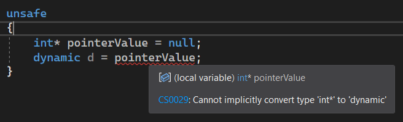
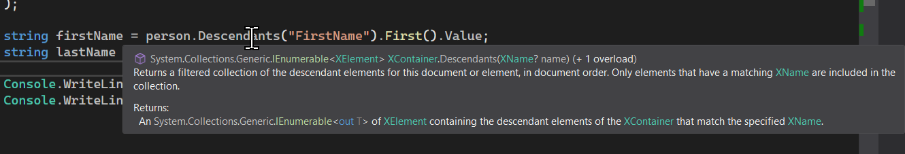
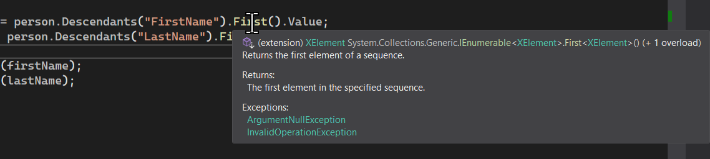
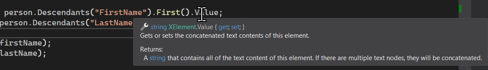
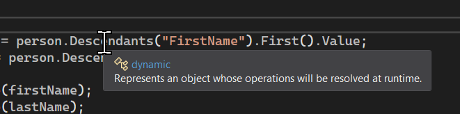
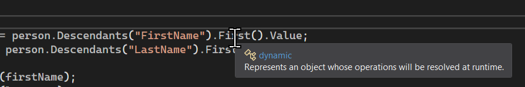
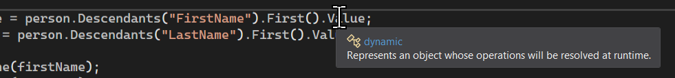

# C# 4 之动态绑定（一）：`dynamic` 关键字

欢迎来到 C# 4！从这里开始，我们将带领各位学习 C# 4 的相关语法。C# 4 一共拥有的新语法特性只有三个：

* **动态绑定**（Dynamic Binding）；
* **泛型委托和接口的泛型参数协变性和你变性**（Co-variance & Contra-variance on Generic Delegate & Interface Types）；
* **可选参数**（Optional Parameter）和**命名参数**（Naming Parameter）。

我们将挨个给大家介绍。

今天我们要给大家介绍的是第一个特性：动态绑定。

## Part 1 引例：简单的反序列化

有些时候，我们可能对于一些处理过程（特别是反射机制）尤其痛苦。

咱们来举一个例子。可能对于你初步学习来说有些难以理解，没事。

还记得序列化吗？序列化就是把一个 C# 里的对象给转换为字符串（或者别的什么表达形式）的等价表达形式，以便我们可以反向操作，把字符串解析为对象，并且能够保持数据一致。序列化的好处在于，比如你在写一个软件，软件需要保存一些配置项。配置项可能需要你在第二次打开程序的时候不会重新被默认设置覆盖掉，于是你可能会做这样的功能。

那么，C# 提供了这样的序列化的 API 允许我们这样处理和操作它们。假如你接触过它们的话，下面这样的代码肯定不难理解：

```csharp
var person = XElement.Parse(
    @"<Person>
      <FirstName>Sunnie</FirstName>
      <LastName>Shine</LastName>
    </Person>"
);

string firstName = person.Descendants("FirstName").First().Value;
string lastName = person.Descendants("LastName").First().Value;

Console.WriteLine(firstName);
Console.WriteLine(lastName);
```

我们使用 `XElement` 类型对一个字符串进行解析，解析后的对象就是这里的 `person` 了。它是 `XElement` 类型的。

> 本例里的这个过程是反序列化，是序列化的逆向操作。序列化是把对象自身转换为可存储到本地的信息（最常见的是字符串，比如这个例子里的字符串）；而反序列化就是倒过来，把本地的这个信息给转换回对象。

接着，我们对这个对象进行取值。我们需要获取的是里面 `FirstName` 和 `LastName` 标签里存储的值。这个操作比较麻烦的地方在，`person` 是 `XElement` 类型的，它包含的值可能有很多，需要我们逐步去迭代。于是，我们在后面调用自带的 `Descendants` 方法。这个方法取的是解析出来的 `person` 信息里的指定标签的对象列表。

然后，得到了这个结果后，我们调用 `First` 方法。还记得前面说的 LINQ 吗？这个方法可以取出一个集合里的第一个元素，不论它是不是有索引器（有索引器相当于 `[0]`，没有就相当于取出第一个迭代的元素）。

最后，得到这个对象后，我们需要取出存储的值，因此还需要对这个表达式结果调用 `Value` 才可取值。这里的 `Value` 属性的返回值是 `string` 类型，即存储本身的数值信息，因此直接赋值给左侧的 `firstName` 和 `lastName` 就可以了。

那么，这样就是完整的取值操作；同理下面的 `lastName` 也是如此。

这个代码没有问题，我们可以得到正确结果；但是，好像很复杂的样子。对于 API 不熟悉的用户来说，并不友好；而且我们可以发现的是，我们待解析的字符串里的标签不一定非得在任何时候都叫 `FirstName` 和 `LastName`，也可以叫别的，比如 `A`、`B` 之类的。那么，灵活性就更强了。上面的代码在 `Descendants` 方法里传入的字符串就是对应了这些标签名，显然就很麻烦，也不统一，使得代码灵活性不够高，维护起来就比较麻烦一些。

C# 4 提供了一种机制，使得代码量大大降低，而且还很好看：

```csharp
dynamic person = DynamicXml.Parse(
    @"<Person>
      <FirstName>Sunnie</FirstName>
      <LastName>Shine</LastName>
    </Person>"
);

string firstName = person.FirstName;
string lastName = person.LastName;

Console.WriteLine(firstName);
Console.WriteLine(lastName);
```

我们注意到，变动的地方有三处：

* 第一行变量返回值类型从 `var` 改成了 `dynamic`；
* 第一行的 `XElement.Parse` 改成了我们自定义创建的类型 `DynamicXml`；
* 第 8、9 行的右值表达式（赋值运算符右侧的表达式）从原本的 LINQ 查询过程改成了简单的属性引用（虽然我们没有这么去定义过）。

别的地方都不用改，程序我们照样是可以跑起来的，而且也可以得到正确的结果。显然，后者就很友好。下面我们就来说说这个用法。

## Part 2 `dynamic` 关键字

### 2-1 动态类型的概念

C# 4 起，引入了一种新的数据类型：**动态类型**（Dynamic Type）。动态类型是一种**弱类型**（Weak-typed）的语法机制。所谓的弱类型，指的是它的语法跟数据类型的概念并没有绑定起来。这样的编程语言有很多，例如 Visual Basic、Python 等等。拿 Python 为例，这个编程语言是具有类型体系的概念的，但你并不需要在使用和编程书写代码的时候去刻意去体现它们，而是运行程序的时候才会去检查类型到底绑定得合不合理、正不正确，比如 Python 定义一个变量：

```python
i = 20        # An integer
j = [1, 2, 3] # An 1-dimensional array
k = "hello"   # A string
```

它就比 C# 简单不少：

```csharp
int i = 20;
int[] j = { 1, 2, 3 };
string k = "hello";
```

因为 C# 必须带有一个类型的匹配项在左侧，而等号的右边必须给出的是它的数值信息；但 Python 在编程期间不会校验检查表达式的类型，因此随便你怎么写都 OK。

对比两个编程语言可以发现，显然 C# 就~~严谨~~复杂了不少，但 C# 正因为这样的类型匹配规则，才构建出了值类型引用类型的复杂体系，编码的时候才会更加严谨。不过，有些时候，**强类型**（Strongly-typed，指类型体系必须在编程期间就必须严格表明和约定）也不见得随时都是好事情。所以，C# 4 开始引入一种新的类型规则，使得我们可以做到和 Python 基本一模一样的类型使用规范。不过，因为 C# 的语法规则约定了我们必须写一个类型在左边，所以 C# 4 为了去规避这样语法设计的规范，就引入了 `dynamic` 关键字。

我们只需要对变量左边写 `dynamic` 而不是实际的类型，就可以将其表达为一个“不确定啥类型”的变量。这就很 Python 了对不对：

```csharp
dynamic i = 20;
dynamic j = new[] { 1, 2, 3 };
dynamic k = "hello";
```

虽然不如 Python 简洁，但起码你可以一劳永逸了对不对。我们把此时 `i`、`j` 和 `k` 变量称为**动态类型变量**（Dynamic-typed Variable），和平时 C# 需要匹配严谨类型的**静态类型变量**（Static-typed Variable）名称相对应。

这里需要你引起注意。`dynamic` 和 `var` 是两回事。`dynamic` 是类型未知，因此你不管什么类型的表达式，全都可以赋值给 `dynamic` 类型的变量来接收；但 `var` 只是一种长类型名称的简写，它仍然是原来的类型，只是写起来有些麻烦，就干脆用 `var` 代替一波。因此，它们有这样的区别。

可能，这些内容还不够你区分开它们。我们再来看一个例子。

```csharp
dynamic d = 230;
d = "test";
d = 1.46;
d = new Person("Sunnie", 25, Gender.Male);
```

在这个例子里，我们定义了 `d` 为动态类型变量，由于它的类型实际是未知的，所以你可以随意为其重新赋值为其它类型的变量。但是这一点 `var` 就做不到：`var` 只是单纯代替长类型名称，因此它该啥类型就啥类型，这样的语法就做不到了。

可能聪明的你会想到一种极端情况：`var` 是 `object` 的时候。大家都知道，`object` 类型可以接收任何非指针类型的数据，所以，它应当是可以兼容我们在可用范围之内所有类型的变量的赋值，因此假设 `dynamic` 替代为 `object` 的话，这样的操作（上面的例子这些赋值过程）应该是可以成立的。实际上，你可以测试一下它们，你会发现确实如此，并且 `object` 执行程序得到的结果，和 `dynamic` 是完全相同的结果。

### 2-2 那么，`dynamic` 类型能接收指针变量吗？

我们来试试：

```csharp
unsafe
{
    int* p = null;
    dynamic d = p;
}
```

你猜，这样的代码可以跑起来吗？答案是否定的，你可以得到一个错误信息提示：



这句话的意思就是在告诉你，你无法把一个 `int*` 类型的指针变量给赋值为 `dynamic` 的变量。那么，`dynamic` 更像是 `object` 了。

### 2-3 `dynamic` 关键字的感染现象

我们试着观察一下引例里给的原版代码，并且稍加改动：

```csharp
dynamic person = XElement.Parse(
    @"<Person>
      <FirstName>Sunnie</FirstName>
      <LastName>Shine</LastName>
    </Person>"
);

string firstName = person.Descendants("FirstName").First().Value;
string lastName = person.Descendants("LastName").First().Value;

Console.WriteLine(firstName);
Console.WriteLine(lastName);
```

假如我们试着给 `person` 改成 `dynamic` 的话，是否可行呢？当然，因为我们才说过，任何数据类型（当然，指针除外）都可以赋值给 `dynamic` 类型的变量来接收，所以这样的赋值肯定是成功的。

不过，原来写 `var` 的时候，我们鼠标放在 `Descendants` 方法上、`First` 方法上以及 `Value` 属性上，我们都可以合理地查看它们对应的调用信息：







可我们改成 `dynamic` 之后，事情就变得奇怪起来了：







好家伙，全成 `dynamic` 了。这就是我们标题给出的 **`dynamic` 感染现象**（`dynamic` Infection）：如果你实例是 `dynamic` 类型之后，由于它自身就已经无法断定类型是什么了，因此在它基础之上得到的调用（方法调用、属性甚至是别的什么）得到的结果也全都是 `dynamic` 类型的结果；而既然结果也是 `dynamic` 了，那么持续往下调用的过程也就是 `dynamic` 的相同行为了，因此可以看到图上给出的结果，其实是合理的，但也是一个比较有趣且奇特的行为。

### 2-4 如果随便乱写，会怎么样呢？

比如说，我对一个本来是 `int` 类型的变量赋值给 `dynamic` 类型的变量，这样是可以的，对吧。但是如果我们将其随便使用，比如使用一些本来 `int` 里就不带的方法，比如 `Hello`，会如何呢？

```csharp
dynamic d = 42;
string targetValue = d.Hello(); // Here.
```

你觉得会如何呢？答案显而易见：由于运行期间 `d` 不包含 `Hello` 方法（严谨一点，甚至无参方法），因此会产生一个异常，叫 `RuntimeBinderException`。这个异常如果一旦抛出，就意味着你有一些地方没有写对，比如这种错误调用。

我们把 `dynamic` 类型的变量后调用一些成员的语句称为**动态绑定**（Dynamic Binding）。如果出现错误调用的过程，就说明我们出现了错误的动态绑定，或者叫动态绑定错误，就会出现运行时异常，因此这个运行时异常类型就显得非常好理解了，runtime 是运行时，binder 是绑定对象，exception 是异常的意思，所以这个类型名称的字面意思就是“绑定实例运行时异常”。

### 2-5 很遗憾，`dynamic` 类型不支持调用扩展方法

什么意思呢？还记得我们前面给的 `First` 方法吗？这个 `First` 是 LINQ 里的一个方法，它是一个扩展方法，将一个可迭代的对象里取出第一个元素。可问题是，它是扩展方法，也就意味着它实际上并不是这个类型自身实例里就包含的方法，这就导致了一个什么呢？这就导致了，`dynamic` 类型经过转换之后，就无从知晓这里的 `First` 到底从何而来。前面的 `Descendants` 方法好歹也是这个 `XElement` 类型里的一个成员，因此调用肯定也能找到合适的情况；但 `First` 就不一定了，它是扩展方法。

所以，`dynamic` 类型里是不支持扩展方法的调用的，因此你需要将其改成原本静态类型里调用的那样去调用。顺带一说，LINQ 里的这些扩展方法都被一个叫 `Enumerable` 的静态类所包裹，因此写法必须是这样的：

```csharp
dynamic person = XElement.Parse(
    @"<Person>
              <FirstName>Sunnie</FirstName>
              <LastName>Shine</LastName>
            </Person>"
);

string firstName = Enumerable.First(person.Descendants("FirstName")).Value;
string lastName = Enumerable.First(person.Descendants("LastName")).Value;

Console.WriteLine(firstName);
Console.WriteLine(lastName);
```

这样就可以了。那么思考一下，如果我们把鼠标放在 `Value` 属性上，你看到的结果应该是


呢，还是


这个呢？

这样的问题其实可以自己思考一阵。

> 答案是后者，你猜对了吗？什么，你不是猜的？牛逼。
>
> 原因很简单，因为你给这个方法传入了一个 `dynamic` 类型的参数进去，使得 `Enumerable.First` 方法无法知晓真正的返回值类型，所以这样的执行后，返回值也是 `dynamic` 类型的。因此，`Enumerable.First` 方法的结果是 `dynamic` 类型的，那么也因此，再次对这个结果调用 `Value` 属性，那么肯定也是 `dynamic` 的，因此你鼠标放在这里的 `Value` 上，也是 `dynamic` 的显示文字信息：Represents an object whose operations will be resolved at runtime.。这句话啥意思呢？represents 是“提供”的意思，an object 是“一个对象”，whose 引出从句，表示“所对应的、所有的”，operation 是“操作”的意思，will be resolved 意思是“被解析”，at runtime 则是“在运行时”的意思。所以这句话的意思是：提供一个对象，该对象的所有操作全部在运行时才会被解析。

## Part 3 `dynamic` 关键字的实现原理

那么，这样神奇的关键字，它底层是怎么去实现的呢？而且，我们刚才发现到它和 `object` 确实很相似，那么这俩到底有什么关系呢？还是说，仅仅是巧合呢？下面我们就来说说。

实际上，**`dynamic` 类型其实就是 `object` 类型**。是的，我们的假设是正确的。在底层来看，`dynamic` 和 `object` 实际上就是一个东西。正是因为这个限制，所以 `dynamic` 不可接收指针类型的表达式结果，而又确实是因为这个原因，所以变量可以重新赋值为别的数据类型也不会有语法错误。从编程的角度出发，如果值类型（比如前面的那些 `int` 赋值给 `dynamic` 这种），就会造成装箱操作，因为毕竟从 `int` 转 `object` 了。

那么，我们调用的这些杂七杂八的方法属性啥的，这些又怎么解释呢？我们举个简单的例子：

```csharp
dynamic d = "hello";
int length = d.Length;
Console.WriteLine(length);
```

够简单了吧。我们把一个字符串赋值给 `d` 变量。因为它是动态类型的变量，因此在后续所有跟 `d` 变量操作有关的处理过程，结果都也全是 `dynamic` 类型的。于是，目光转向第 2 行代码可以看到，`d.Length` 结果就会变为 `dynamic` 类型的变量，而由于 `dynamic` 类型是未知的数据类型，因此赋值给 `length` 变量的话，也不会被编译器发现错误，因此，编译器从语法角度来说是没问题的，因此予以通过，因此 `int length = d.Length` 是正确的写法。

接着，我们显示 `length` 变量作为结果输出。我们可以得到正确的结果吗？可以。下面我们就来分析一下这个代码到底是如何执行的。

严谨一点。C# 是强类型的编程语言，因此所有的操作和转换虽然可能从语法上不体现，但你也需要补回去。那么它等于啥呢？

```csharp
using Microsoft.CSharp.RuntimeBinder;
using System;
using System.Runtime.CompilerServices;

class Program
{
    static void Main()
    {
        object arg = "hello";
        if (ReferenceEquals(DynamicTypeGenerated.Conversion, null))
        {
            DynamicTypeGenerated.Conversion = CallSite<Func<CallSite, object, int>>.Create(
                Binder.Convert(CSharpBinderFlags.None, typeof(int), typeof(Program))
            );
        }

        var target = DynamicTypeGenerated.Conversion.Target;
        if (ReferenceEquals(DynamicTypeGenerated.LengthProperty, null))
        {
            var typeFromHandle = typeof(Program);
            var array = new CSharpArgumentInfo[] { CSharpArgumentInfo.Create(CSharpArgumentInfoFlags.None, null) };

            DynamicTypeGenerated.LengthProperty = CallSite<Func<CallSite, object, object>>.Create(
                Binder.GetMember(CSharpBinderFlags.None, "Length", typeFromHandle, array)
            );
        }

        Console.WriteLine(
            target(
                DynamicTypeGenerated.Conversion,
                DynamicTypeGenerated.LengthProperty.Target(DynamicTypeGenerated.LengthProperty, arg)
            )
        );
    }
}

static class DynamicTypeGenerated
{
    public static CallSite<Func<CallSite, object, object>> LengthProperty;
    public static CallSite<Func<CallSite, object, int>> Conversion;
}
```

等于这样一段代码。其中 `DynamicTypeGenerated` 类型是自动生成的类型，而前面的代码则是等价转换过去的代码。我们挨个理解一下。

### 3-1 第 9 行代码：`dynamic` 赋值语句

第 9 行代码直接对应上了这个赋值语句，因为我们说过，`dynamic` 实际上就是 `object`，所以底层翻译的时候直接就是赋值给了 `object`，这没有问题对吧。

### 3-2 第 10 到第 15 行代码：绑定隐式转换

你很好奇，`dynamic d = "hello"` 哪里来的转换。实际上，转换不在这里，而是 `int length = d.Length` 这里。这里一共发生了两次动态调用的过程，一次是 `d.Length`，对 `d` 变量取 `Length` 属性；而另外一次，其实是这个由于该结果的类型是 `dynamic` 类型，因此赋值给 `int` 类型是类型不匹配的。只是因为编译器并未对类型进行检查，所以放任了这种过程。实际上，`dynamic` 是 `object`，所以此处有一次拆箱的转换：`object` 转 `int`。

我们仔细观察类型就会发现，左值表达式（即赋值运算符左侧的表达式）`DynamicTypeGenerated.Conversion` 对应了第 41 行的 `Conversion` 静态字段。它并未标记为 `readonly`，因为它在此时是修改了数值的。

仔细观察赋值过程（虽然有点复杂），但是很好看到的是，它是一个由 `CallSite<>` 的泛型类型包裹起来了的一个表达式处理过程。我们教过大家如何观察和理解复杂泛型类型，那么，这里的 `CallSite<Func<CallSite, object, int>>` 就是一个典型的嵌套的类型。这里的 `CallSite<>` 包裹了一个委托类型，表达的是这个动态处理过程到底是如何的进行规则。比如这里，我们是一个拆箱转换，因此我们如果写成 lambda 表达式的话，肯定是 `(object o) => (int)o`，即 `object` 类型的参数 `o` 执行表达式 `(int)o`，得到的结果反馈回去。

那么这里的委托类型 `Func<CallSite, object, int>` 里，第一个类型参数 `CallSite` 是一个无泛型参数的类型。它包裹的是我们进行处理转换动态操作的一个**上下文**（Context）信息。好吧，你肯定一头雾水咋一口气出现了俩 `CallSite` 名称的类型。

`CallSite` 类型，不管包不包含泛型参数，它都表示一个上下文信息。啥叫上下文？考虑一下你在和另外一个人下棋，下棋用到的棋盘，棋盘落子的位置，如果要写成代码的话，你在处理和玩棋期间，它们都是会变动的数据，也是重要的数据，因此你可能会存储起来。不管你存什么，怎么存储吧，但它们都是重要的信息，作为游玩期间的必须信息。在游玩结束之前，它们都会存在。这种只存在一段时间的数据，我们就称为上下文数据。如果粗糙理解的话，你就可以理解成这样即可。对于这个例子里的话，我们处理 `dynamic` 的一条~~蛇~~龙服务的操作期间，就相当于是下棋的过程。在处理运算期间，这些数据要保存起来，就是通过的这个 `CallSite` 在存储。带泛型参数的类型，往往包裹的就是具体的处理行为，所以也是因为这个原因，它的泛型参数往往是一个委托类型；而不包含泛型参数的版本，则是这个带有泛型参数的 `CallSite<>` 类型的基类型。是的，它俩是派生关系。

> 你不用掌握得很深入，因为这些内容说细了的话，展开可以跟表达式树一样复杂。所以咱挑选简单一些的理解来说，毕竟我们写代码完全用不上它们，只是底层会遇到它们。你去面试也可能会遇到这种题。

再回头看看 `Create` 方法。该方法是一个静态方法，它左边传入的就是这个 `CallSite<>` 上下文类型。调用这个方法的目的是为了创建出一个可提供后期执行的委托实例。这里的委托实例包装起来了你可能看不到，但实际上它确实被包裹起来了。

这里 `Create` 传入了三个参数你也不必理解得很深入，大概就是你需要给运行时提供基本的调用信息。调用信息有三个：是否带有额外信息、返回值类型，以及该上下文在哪里执行的。

我们传入的三个参数分别是 `CSharpBinderFlags.None`、`typeof(int)` 和 `typeof(Program)`，都很好理解，对吧。

### 3-3 第 17 行代码：拆除上下文的包裹，得到委托实例

上下文类型里包裹了委托，我刚才说过这个话，对吧。现在我们取出它，目的是稍后调用，所以这里有一个变量专门取它。这里用到的是这个上下文类型里包含的 `Target` 属性。

### 3-4 第 18 到第 26 行代码：绑定 `Length` 属性取值

我们刚才处理用到了 `dynamic` 的处理过程，除了一个转换，还有一个取值 `Length` 属性。这个比较复杂，因此这里我们要看一下这里的 `if` 条件以及里面的代码。

和前文一样，先判空。如果为空则赋值，有效避免重复赋值。

接着，这里我们用到了的是调用语句，因此比起原始的处理过程要复杂许多。首先是 `Length` 属性调用。

```csharp
var array = new CSharpArgumentInfo[] { CSharpArgumentInfo.Create(CSharpArgumentInfoFlags.None, null) };

DynamicTypeGenerated.LengthProperty = CallSite<Func<CallSite, object, object>>.Create(
    Binder.GetMember(CSharpBinderFlags.None, "Length", typeof(Program), array)
);
```

这一截代码我们也用的是 `Create` 方法，不过仔细注意 `CallSite<>` 的泛型参数就可以发现，这次后面的俩参数都是 `object` 了。这是为啥呢？不是 `Length` 是 `int` 结果吗？还记得我前面说的什么吗？`dynamic` 感染。`dynamic` 实例调用的所有东西也都是 `dynamic` 的结果，因此这里的 `dynamic` 对应了 `object` 的话，因此编译器无从知晓具体的返回值类型，所以俩参数都是 `object` 的。

接着，这次我们传入的不再是前文用到的 `Binder.Convert` 了，因为 `Convert` 的意思是转换，意味着用法是转换机制；而这里则是属性的调用，所以这里用 `GetMember` 另外一个方法。参数这次就成四个了。第一个仍然是 `CSharpBinderFlags.None`，因为目前来说这个地方是固定的；而第二个参数则是调用的成员的字符串写法。因为 `d.Length` 的成员就是 `Length`，所以这里就传入一个 `Length` 的字符串就可以；第三个参数也是暗示的上下文在哪个类型里执行，这里也是一样；最后一个参数传入的是参数。由于 C# 4 的动态绑定的设计规则，`GetMember` 可以获取属性也可以获取索引器和别的成员。如果我们把索引器和方法看成带参成员的话，那么这里的属性就是无参成员。这里我们需要传入的是无参的状态信息，这里给出的第一行代码（上面这个代码里的第一行）就是默认带有一个基本信息的实例。这是固定的，也就是说你可以照抄在你的代码里去（当然一般也不会这么去写底层代码）。

最后，我们把这个数组传入到第四个参数里，大功告成。

### 3-5 第 28 到第 33 行代码：输出 `length` 变量的结果

最后我们要输出结果了。这里稍微麻烦一些，因为我们前文用到的就是这种动态处理特别复杂，所以这里也不简单。最后这里，我们需要把前面得到的两个静态属性的数值给一并传入，并且得到合适的结果。

先来说说 `target` 这个变量（前文第 17 行代码里得到）。在这个变量里，我们要求传入两个参数，一个 `CallSite` 上下文信息，一个 `object` 类型实例，且返回 `int` 结果。于是，我们第一个参数传什么呢？可以看到例子里给的是把 `Length` 取值操作给传过去了。

这是因为，我们先有了 `Length` 取值，才会有转换。因此，我们优先给出前一步的处理规则作为上下文信息，然后才能有下一步的处理信息。这是合理的，虽然有点奇怪。

接着，第二个参数传入的则是 `object` 实例，即 `d.Length` 里的这个 `d` 的转换。这个 `d` 在底层是 `object` 类型的，前文已经说过了。不过这里不能直接传实例进去，因为这里，我们要先做 `Length` 取值，这我们还没开始呢。取值过程很简单，模拟“实例.Length”的调用行为即可。怎么模拟呢？请看代码：

```csharp
DynamicTypeGenerated.LengthProperty.Target(DynamicTypeGenerated.LengthProperty, arg)
```

这表达式是怎么理解的呢？先是 `DynamicTypeGenerated.LengthProperty`，这是包裹了 `Length` 属性取值的上下文实例，包含取值的委托。接着我们前文说到，我们要用 `Target` 属性来取里面的委托实例。不过这次，因为我们是调用 `Length` 属性，因此需要我们额外传入实例进去，这里的 `Target` 就从实例改成了方法。方法要两个参数，一个是到底取什么玩意儿的上下文（那么这里还是传入 `DynamicTypeGenerated.LengthProperty` 它自己），然后第二个参数给的则是实例本身了。那么，我们拿出前文的 `args` 变量（定义在第 9 行），赋值过来即可。

这样的表达式得到的就是那个委托。然后我们把此委托传入到外层的 `target` 委托里当第二个参数。这便是整个处理过程。

### 3-6 总结

下面我们来做一个处理过程的总结吧。`dynamic` 的调用会被翻译成一系列的 `CallSite` 以及 `CallSite<委托>` 的上下文对象。这些对象包裹了一系列转换、调用的处理信息留着我们之后一并调用起来。处理过程期间，我们会按照整个调用 `dynamic` 处理操作的顺序，逐个得到变量的顺序去带入 `CallSite` 和 `CallSite<委托>` 的 `Create` 方法里去作为上下文创建出来。

创建完成后，我们就有了处理的上下文了。下面我们就需要去调用拆解上下文实例，去执行里面的委托。执行委托的办法是使用 `Target` 属性或 `Target` 方法。使用 `Target` 属性是因为它不需要额外的信息；而 `Target` 方法则带有处理信息，比如 `Length` 属性前面用到的这个实例对象。

最后，我们输出调用结果，也就是在执行这些个委托。

来看一下结果吧：


答案是对的：`"hello".Length` 可不就是 5 嘛。

那么今天我们就先说到这里。下一节内容我们将继续讨论 `dynamic` 关键字，因为，我们前文的引例的这个用法，我们并未在这里涉及和讲到，下一节内容我们将来探讨一下，如何自定义一个可用来动态取成员的语法规则。
