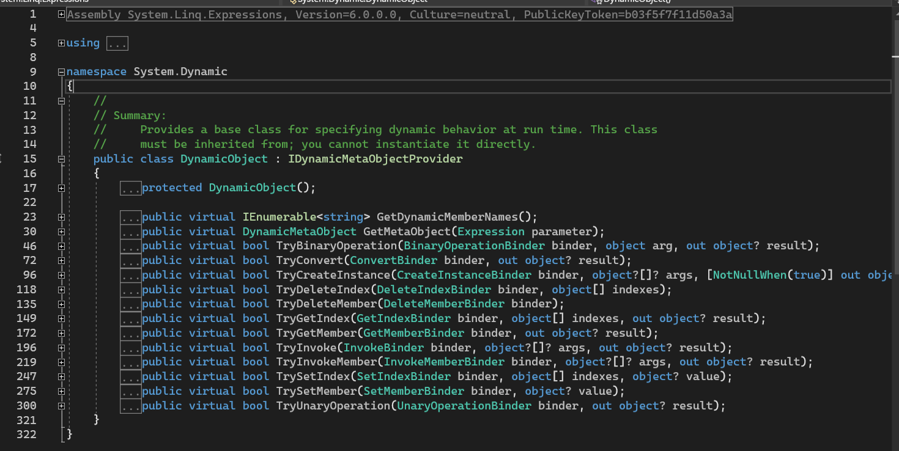

# C# 4 之动态绑定（二）：`DynamicObject` 抽象类型

在上一节内容里我们讲到了如何去使用一个 `dynamic` 关键字定义出来的类型，以及它的底层原理（实现是用的 `object` 来接收的，使得过程会产生装拆箱操作）。

今天我们来看看我们前文没有解决的另外一个维度的问题，就是如何将一个对象动态化，搞成一个直接在后面用小数点跟上一个可能完全不存在的属性，比如前文的 `.FirstName` 和 `.LastName` 这样的规则。

## Part 1 引例：数据字典包装类

### 1-1 使用字典类型

考虑一种用法。假设我定义了一个字典，这个字典包含了众多我们可能在程序里会用到的文字信息。举个例子，我们的程序是走国际化路线的，也就意味着我们可能需要实现一套代码，存储中文和英语两种不同的语言的用法。比如说，我有一个求和运算的简易程序，有两个输入框和一个按钮，按钮提示用户按下去就获取结果。按钮在中文环境下是显示为“求和”，而在英语里则显示为“add”。

咱们简化一下。我们不在这篇文章里实现整个代码，而只关心这个存储的“求和”和“add”这个信息到代码里去，并且怎么调取出来。显然，我们可以想到一个办法：字典。

字典数据类型 `Dictionary<,>` 可以按照指定类型来获取数值。而且它在 C# 里有一个骚操作，使用索引器的语法，就可以取值。于是，考虑这样的行为，我们可以这么去做。

```csharp
var chineseDic = new Dictionary<string, string> { { "AddOperationName", "添加" } };
var englishDic = new Dictionary<string, string> { { "AddOperationName", "add" } };
```

> 这里用到一个 C# 提供的字典的初始化器的语法。字典的元素初始化器语法的最外层和别的数据类型也一样，也是一对大括号。不过和别的类型不一样的地方是，因为字典的 `Add` 方法要两个元素，因此 C# 对这个数据类型具有特殊的初始化语法规则：使用的是嵌套级别的一对大括号，大括号只包含两个元素，其中第一个是它的键，而第二个则是它的值。
>
> 这个语法在前文 C# 3 里并未说明，因为在之前的文章里用不到该数据类型，所以就没有过多讲解。

### 1-2 封装一个 `ResourceDictionary` 类型

为了我们稍后能够灵活稳定处理多个语言的话，我们可以包装一个专门的类型：`ResourceDictionary` 类型：

```csharp
internal struct ResourceDictionary
{
	private readonly IDictionary<string, string> _kvp;

	public ResourceDictionary(IDictionary<string, string> rawValues) { _kvp = rawValues; }

	public string this[string key] { get { return _kvp[key]; } }
}
```

比如这样。很好理解，对吧。

> 当然，你用 `sealed class` 也可以，这里用 `struct` 单纯是因为它内部只有一个数据成员 `_kvp`，还是引用类型的。学过 C# 的小伙伴应该都知道，嵌套级别的数据成员，如果是引用类型的话，不管是存储在值类型里，还是在引用类型里，它都是以引用的形式存在。所谓的引用，在底层也就是一个一个的地址数据。所以，这里的 `_kvp` 其实是一个地址罢了。一个地址数值只占据很小的内存空间，因此定义为 `struct` 的话，在实例化该类型的对象的时候，比 `class` 就要快上不少。

接着，我们有了这个类型之后，将对象给存储进去。

```csharp
var chineseResourceDic = new ResourceDictionary(chineseDic);
var englishResourceDic = new ResourceDictionary(englishDic);
```

### 1-3 `CultureInfo.CurrentCulture` 属性获取语言习惯

那么，如何去做到按语言去取字典的数值呢？这里我们用到的是一个叫国际化的类型：`CultureInfo`。这个类型可以取出我们当前用户在运行的这个程序所在操作系统，用的是什么语言。

```csharp
var culture = CultureInfo.CurrentCulture;
switch (culture.Name)
{
    case "zh-CN": // 中国大陆用的简体字版的文字。
        break;
    case "en-US": // 英语文字。该结果适用于美国的英语用法习惯的文字。
        break;
}
```

这里稍微说清楚一点。由于地理位置的特殊性，台湾地区、香港地区和澳门地区作为使用繁体字的地区，它们的习惯和内陆地区使用的中文并不相同，内陆使用的是简体字，而台湾、澳门和香港地区则用的是繁体字。而且就台湾、澳门和香港这三个地区来看，它们自己的繁体字写法也有时候不相同，因此如果你在台湾地区、香港地区的话，得到的结果就不会是 `zh-CN` 这个结果，比如台湾地区在这个规则上得到的结果是 `zh-TW` 而不是 `zh-CN`。虽然咱们都知道，它们是中国不可分割的一部分，但对于文字习惯来说，使用中文汉字的习惯并不相同，因此就导致了同样使用中文的地方也有不同的使用规范和标准，因此，台湾、香港和澳门地区在语言的使用标准上就被分离出来了。所以请不要对于这样的问题进行鸡蛋里挑骨头的无理取闹。

### 1-4 封装一个 `Resource` 类型作为终极类型

那么，我们现在有了包装类型，并且也学会了如何去按语言分配和取字典信息了，下面我们就来完善整个行为。我们要想让用户可以优雅地使用这个多语言的字典，我们光实例化出来两个 `ResourceDictionary` 还不够。因为这样并不方便，像是做特别复杂的国际化处理的时候，这样的字典可能包含几十个。是的，确实是几十个。所以这样实例化字典之后，使用 `switch` 来判断使用具体哪个字典的行为并不优雅。那么怎么做呢？

我们再套一层 `Dictionary<,>` 对象。这次，我们把键值对的键和值分别对应上 `string` 和 `ResourceDictionary`。其中的 `string` 是这里通过 `CultureInfo.CurrentCulture` 属性得到的实例，取 `Name` 而得到的字符串结果；而通过字符串相等性的比较，我们就可以达到找寻对应字典的用法。

```csharp
internal sealed class Resource
{
	private readonly IDictionary<string, ResourceDictionary> _dics = new Dictionary<string, ResourceDictionary>();

	public Resource() { }

	public void Add(string cultureName, ResourceDictionary dictionary)
	{
		_dics.Add(cultureName, dictionary);
	}
}
```

我们定义出一个 `Resource` 类型来存储它们。通过我们添加的 `Add` 方法来开放给用户使用，这样用户就可以往里面追加字典了。做法很简单：

```csharp
var resource = new Resource();
resource.Add("zh-CN", chineseResourceDic);
resource.Add("en-US", englishResourceDic);
```

### 1-5 追加 `Resource` 的字典取值成员

既然有了终极类型了，那么我们自然是需要通过这个综合对象来完成不同语言取不同字典的规则。对于这个类型来说，我们需要开放一个用户可以使用的取值规则。做法是开一个和 `ResourceDictionary` 一样用途的索引器，传入 `string` 类型当参数。由于 `ResourceDictionary` 的索引器是因为底层的字典被包装起来了所以必须打开索引器来取里面的数据，而 `Resource` 类型是高阶的用法，所以它的索引器除了取值用，还要额外带有判断语言习惯的操作。所以，我们要设计为这样才比较合理：

```csharp
public string this[string key]
{
    get
    {
        // 获取当前用户电脑的语言习惯。
        string cultureName = CultureInfo.CurrentCulture.Name;

        ResourceDictionary resourceDic;
        try
        {
            // 尝试去取值。这里 First 方法可以传入 lambda 来达到
            // 遍历和看条件是否满足的操作。
            // 注意，如果列表里一个成员都不满足的话，那么这个方法
            // 会直接产生 InvalidOperationException。
            // 我们需要捕获该异常，目的是为了给 resourceDic 变量
            // 补上一个默认情况，避免程序崩溃。
            resourceDic = _dics.First(kvp => kvp.Key == cultureName).Value;
        }
        catch (InvalidOperationException)
        {
            // 找不到合适的字典，语言习惯是匹配的情况。
            // 那么此时我们要补充一个默认情况：用英语作为默认情况。
            // 不要问我为啥不用中文做默认情况。我只是举个例子。
            resourceDic = _dics["en-US"];
        }

        // 最后，按照这个字典进行取值。
        return resourceDic[key];
    }
}
```

### 1-6 试着使用一下自己写的数据字典包装类

然后，我们就算完成了整个封装包装过程。下面，我们只需要在主方法里进行处即可。

```csharp
string addOperationName = resource["AddOperationName"];
Console.WriteLine(addOperationName);
```

第一行代码用到 `resource` 变量的索引器操作。这个 `resource` 就是前文里定义出来的那个 `resource`。来看看完整的代码吧：

```csharp
using System;
using System.Collections.Generic;
using System.Globalization;
using System.Linq;

internal static class Program
{
    /// <summary>
    /// 主方法。程序的入口点。
    /// </summary>
    private static void Main()
    {
        // 预先存储一系列的数据到代码里去。
        var chineseDic = new Dictionary<string, string> { { "AddOperationName", "求和" } };
        var englishDic = new Dictionary<string, string> { { "AddOperationName", "add" } };

        // 实例化两个资源字典。
        var chineseResourceDic = new ResourceDictionary(chineseDic);
        var englishResourceDic = new ResourceDictionary(englishDic);

        // 完成一个融合字典对象。
        var resource = new Resource();
        resource.Add("zh-CN", chineseResourceDic);
        resource.Add("en-US", englishResourceDic);

        // 试着取一个值。
        string addOperationName = resource["AddOperationName"];
        Console.WriteLine(addOperationName);
    }
}

internal struct ResourceDictionary
{
    private readonly IDictionary<string, string> _kvp;

    public ResourceDictionary(IDictionary<string, string> rawValues) { _kvp = rawValues; }

    public string this[string key] { get { return _kvp[key]; } }
}

internal sealed class Resource
{
    private readonly IDictionary<string, ResourceDictionary> _dics = new Dictionary<string, ResourceDictionary>();

    public Resource() { }

    public string this[string key]
    {
        get
        {
            // 获取当前用户电脑的语言习惯。
            string cultureName = CultureInfo.CurrentCulture.Name;

            ResourceDictionary resourceDic;
            try
            {
                // 尝试去取值。这里 First 方法可以传入 lambda 来达到遍历和看条件是否满足的操作。
                // 注意，如果列表里一个成员都不满足的话，那么这个方法会直接产生 InvalidOperationException。
                // 我们需要捕获该异常，目的是为了给 resourceDic 变量补上一个默认情况，避免程序崩溃。
                resourceDic = _dics.First(kvp => kvp.Key == cultureName).Value;
            }
            catch (InvalidOperationException)
            {
                // 找不到合适的字典，语言习惯是匹配的情况。
                // 那么此时我们要补充一个默认情况：用英语作为默认情况。
                // 不要问我为啥不用中文做默认情况。我只是举个例子。
                resourceDic = _dics["en-US"];
            }

            // 最后，按照这个字典进行取值。
            return resourceDic[key];
        }
    }

    public void Add(string cultureName, ResourceDictionary dictionary) { _dics.Add(cultureName, dictionary); }
}
```

来看看效果：


“求和”二字就是我们最开始在主方法里写的读入的数据信息“求和”。至此，引例就完成了。如果你还需要写更多的语言的字典的话，只需要往 `resource` 变量里加就行了。而至于这个 `zh-CN` 啊，`en-US` 怎么得来的，请参考网上给出的表格。这个叫做 [i18n 语言代码表](https://en.wikipedia.org/wiki/Locale_(computer_software))（英语叫 Locale Codes）。

说起来很有意思，i18n 这个词语的由来竟然是因为 internationalization 单词太长了，一共 20 个字母，i 和 n 是它的头尾，剩下一共 18 个字母，所以就简写成 i18n 了。

## Part 2 `DynamicObject` 类型

在我们前文的取值代码里，我们用到了索引器：

```csharp
string addOperationName = resource["AddOperationName"];
Console.WriteLine(addOperationName);
```

该索引器用法也不复杂，但也确实很丑陋。尤其是字典用多的时候，一大堆的 `resource["键"]` 的用法，搞得代码非常不好看。于是，我们会去处理和修正语法规则，使得我们把它视为动态实例，写成这样：

```csharp
string addOperationName = resource.AddOperationName;
Console.WriteLine(addOperationName);
```

我们想让它也可以生效。这怎么做到呢？难道直接把前面的 `var resource = ...` 给改成 `dynamic resource = ...` 这么简单吗？当然不是。因为这里的索引器参数是一个字符串啊，我们直接是将这个字符串同等当成属性方在了实例的右边。这种用法实在是不可能只是简单改成 `dynamic` 而已。那么，怎么做呢？

### 2-1 定义单例

**单例模式**（Singleton Pattern）不知道你听说过没有。这是 C# 编程语言里的一种设计模式。可能你对设计模式并不熟悉，所以我们就直接在这里说清楚了吧。单例模式就是往这个类型里创建一个可以随时随地访问的静态只读实例，并防止用户再次对类型进行实例化的设计模式。做法很简单，改掉两处代码：

1. 定义单例；
2. 私有化构造器。

```diff
  internal sealed class Resource
  {
+     public static readonly Resource Instance = new Resource();
      private readonly IDictionary<string, ResourceDictionary> _dics = new Dictionary<string, ResourceDictionary>();

-     public Resource() { }
+     private Resource() { }
```

私有化构造器，然后把构造器呢，用于这个静态只读的实例 `Instance`，它作为唯一一个你可以对接使用 `Resource` 类型对象的方案而存在。这就叫单例模式。

单例模式的其中一个作用（即我们这里用到的作用）是防止用户误用代码，创建过多没有意义的实例出来。

### 2-2 让 `Resource` 类型从 `DynamicObject` 派生

接下来就是这篇文章的重头戏了。我们需要让 `Resource` 类型从 `DynamicObject` 类型派生。好在我们刚好给 `Resource` 用引用类型实现了。因为值类型是无法自定义继承派生关系的，所以这个只能引用类型来做。

```csharp
internal sealed class Resource : DynamicObject
```

把头部改成这样即可。

这个 `DynamicObject` 作为关键的一步，我先说明一下它是什么。

它是我们将对象动态化的一个重要规则和约定。如果一个对象可以使用前文那样的动态属性调用一个完全没有的成员，却可以定义出一套固定的取值规则和标准的话，那么必须要从这个 `DynamicObject` 类型进行派生。派生之后，对象就有了 `dynamic` 后引用一个完全不存在的成员，但又可以正确执行的能力了。

### 2-3 重写 `TryGetMember` 方法

接着，虽然我们并未对代码进行重写好像也没问题，但是我们这里需要重写一个里面的方法，目的是为了关联上前文的 `resource.AddOperationName` 的神奇调用规则，以及字典。

在从 `DynamicObject` 类型派生之后，我们可以搞到这样的重写：

```csharp
public override bool TryGetMember(GetMemberBinder binder, out object result)
{
    return base.TryGetMember(binder, out result);
}
```

输入 `override`，就可以看到 `TryGetMember` 方法，然后按 tab 按键确认你的输入，就可以得到这样的代码。不过，这个 `base.TryGetMember` 是在调用基类型的默认的代码，因此没有意义，我们要将其删除，改成我们自己用的代码。

先来简要介绍一下两个参数。第一个参数 `binder` 提供绑定的信息，也就是我们刚才使用的 `resource.AddOperationName` 语法里，属性引用的这个 `AddOperationName` 的基本用法规则和信息；而第二个参数，则是返回我们应该正常通过 `resource.AddOperationName` 的用法应该正常返回什么结果出来。返回值 `bool` 类型是暗示了我们是否可以这么去使用。

考虑到例子里，我们是按字典取值的，所以我们可以把返回值定义理解为“是否可以成功从字典里取到合适的结果”，而 `out object result` 这个参数则返回出来这个看起来很像是属性引用的表达式的结果。

我们改写代码为这样：

```csharp
public override bool TryGetMember(GetMemberBinder binder, out object result)
{
    // Name 属性取出属性引用的信息。比如前文的 resource.AddOperationName 里的 "AddOperationName"。
    string propertyReference = binder.Name;

    // 然后调用字典取值。
    try
    {
        // 通过 this 对象来取数值。我们最开始的用法是 this["AddOperationName"] 这样的语法，
        // 而现在前文的 binder.Name 得到了这个字符串，因此我们直接把这个变量放进索引器符号里，
        // 即可表示出取值。
        // 如果这个操作没有抛异常的话，那么我们就可以大大方方退出程序返回 true，
        // 并把结果赋值给 result 参数，就可以走人了。
        result = this[propertyReference];
        return true;
    }
    catch
    {
        // 捕获异常了，比如说取值失败，字典处理异常等等错误，只要产生了异常就会被捕获。
        result = null;
        return false;
    }
}
```

看起来实现有些复杂，但多数都是注释文字。我们仔细理解一下注释。

首先，我们通过第一个参数 `binder` 的 `Name` 属性，获取到属性引用的那个成员的信息。因为这里是动态使用的，编译器并不会发现错误，所以编译通过；而对于底层来说，这个属性引用实际上是不存在的，所以它不外乎就是一个字符串一样的存在。因此，`binder.Name` 得到的结果就是字符串形式的表达。这一点很神奇，属性引用的属性居然被转为了字符串写法。

然后，我们使用一个 `try`-`catch` 语句来完成取值。注意，这里尽量不要抛异常，是为了保证取值的成功或失败。失败的话，C# 会自动产生异常，因此不必我们手写。懂意思吗？就是说，这个方法只是动态调用过程的其中核心一步，而其它的步骤都被 C# 包装好了，行为也都包装好了，因此不必我们在方法里抛异常来告知用户出错，抛异常留给 C# 就行。这个方法如果返回 `false`，就表示我们绑定失败，于是就会产生 `RuntimeBinderException` 异常，在前文已经说过了。

至此，我们就算把关键的行为和操作给说完了。

### 2-4 单例模式的类型改成 `dynamic`

这一步很关键。我们在前文给出的是 `Resource Instance = new Resource()`，现在我们需要改成 `dynamic Instance = new Resource()`：

```csharp
public static readonly dynamic Instance = new Resource();
```

这一步很关键。目的是为了让对象真的可以动态处理。因为我们之前的 `Resource` 类型都是以实际类型存储和存在的，这里改成 `dynamic` 后，对象又从 `DynamicObject` 类型派生，因此 C# 会识别代码，并自动知道如何去处理。

### 2-5 修改 `Main` 方法的代码

最后一步是修改 `Main` 的代码。我们改下后面的部分，完整的代码如下：

```csharp
// 预先存储一系列的数据到代码里去。
var chineseDic = new Dictionary<string, string> { { "AddOperationName", "求和" } };
var englishDic = new Dictionary<string, string> { { "AddOperationName", "add" } };

// 实例化两个资源字典。
var chineseResourceDic = new ResourceDictionary(chineseDic);
var englishResourceDic = new ResourceDictionary(englishDic);

// 完成一个融合字典对象。
Resource.Instance.Add("zh-CN", chineseResourceDic);
Resource.Instance.Add("en-US", englishResourceDic);

// 试着取一个值。
string addOperationName = Resource.Instance.AddOperationName;
Console.WriteLine(addOperationName);
```

这里的 `Resource.Instance` 就是在使用这个单例，而这里的 `Add` 方法和 `AddOperationName` 这个“假属性”也都在正常操作和调用方法的具体内容。其中，`Add` 方法本身就存在，所以不管它是不是 `dynamic` 类型的，这个方法也都会被正常处理和执行到；而下面的 `AddOperationName` 并不存在，但属性的引用的底层实现被我们重写了，所以也不会出错。

再来看下这次我们修改后的完整版代码吧：

```csharp
using System;
using System.Collections.Generic;
using System.Dynamic;
using System.Globalization;
using System.Linq;

internal static class Program
{
	private static void Main()
	{
		var chineseDic = new Dictionary<string, string> { { "AddOperationName", "求和" } };
		var englishDic = new Dictionary<string, string> { { "AddOperationName", "add" } };

		var chineseResourceDic = new ResourceDictionary(chineseDic);
		var englishResourceDic = new ResourceDictionary(englishDic);

		Resource.Instance.Add("zh-CN", chineseResourceDic);
		Resource.Instance.Add("en-US", englishResourceDic);

		string addOperationName = Resource.Instance.AddOperationName;
		Console.WriteLine(addOperationName);
	}
}

internal struct ResourceDictionary
{
	private readonly IDictionary<string, string> _kvp;

	public ResourceDictionary(IDictionary<string, string> rawValues) { _kvp = rawValues; }

	public string this[string key] { get { return _kvp[key]; } }
}

internal sealed class Resource : DynamicObject
{
	public static readonly dynamic Instance = new Resource();
	private readonly IDictionary<string, ResourceDictionary> _dics = new Dictionary<string, ResourceDictionary>();

	private Resource() { }

	public string this[string key]
	{
		get
		{
			string cultureName = CultureInfo.CurrentCulture.Name;
			ResourceDictionary resourceDic;
			try
			{
				resourceDic = _dics.First(kvp => kvp.Key == cultureName).Value;
			}
			catch (InvalidOperationException)
			{
				resourceDic = _dics["en-US"];
			}

			return resourceDic[key];
		}
	}

	public void Add(string cultureName, ResourceDictionary dictionary) { _dics.Add(cultureName, dictionary); }
	public override bool TryGetMember(GetMemberBinder binder, out object result)
	{
		string propertyReference = binder.Name;

		try
		{
			result = this[propertyReference];
			return true;
		}
		catch
		{
			result = null;
			return false;
		}
	}
}
```

来看这次我们得到的结果：


非常好，我们修改了之后也得到了我们要的结果，而且代码虽然更多了，但是主方法里的代码更优雅了。封装是麻烦的，但是用起来是方便的，这就是编程。

## Part 3 `DynamicObject` 支持的处理行为

实际上，不仅是前文用到的属性的绑定，还有很多的成员全都可以在 `DynamicObject` 的部分成员重写之后完成正常的执行和使用。我们打开 `DynamicObject` 对象的元数据：



可以发现它竟然有这么多方法。其中：

* `TryBinaryOperation`：对一个 `dynamic` 对象参与的二元运算符行为进行执行处理。比如说我对了一个 `dynamic` 对象和一个 `int` 使用了 `+` 运算符操作，那么具体在底层绑定和定义处理规则的时候，你需要重写这个方法；
* `TryConvert`：对一个 `dynamic` 对象上使用到的强制转换或隐式转换（虽然 `dynamic` 类型自身很少有隐式转换）进行处理。比如如果我用到了一个 `dynamic` 类型的 `obj` 对象的 `(int)obj` 操作，你就需要重写这个方法；
* `TryCreateInstance`：对一个 `dynamic` 对象进行实例化。常见的情况就是 `new` 一个出来；
* `TryDeleteIndex`：这个方法对应到 C# 里没有相同的语法，所以就不介绍了；
* `TryDeleteMember`：这个方法对应到 C# 里也没有相同的语法，所以就不介绍了；
* `TryGetIndex`：对一个 `dynamic` 对象使用索引器取值的时候。比如 `dynamic` 的对象 `obj` 使用了 `obj[1, 2, 3]` 如此的语法；
* `TryGetMember`：对一个 `dynamic` 对象使用了属性或字段的时候。这个方法就是前文里重写的那个；
* `TryInvoke`：对一个 `dynamic` 对象，直接当委托的形式直接跟小括号调用的语法。比如 `dynamic` 对象 `obj` 直接使用 `obj(1, 2, 3)` 这样的语法的时候；
* `TryInvokeMember`：对一个 `dynamic` 对象调用类似方法调用的规则。比如 `dynamic` 对象 `obj` 调用类似 `obj.InnerMethod(1, 3)` 这样的方法的时候；
* `TrySetIndex`：对一个 `dynamic` 对象使用索引器在赋值的时候。比如 `dynamic` 对象 `obj` 使用了 `obj[3] = 0` 如此的语法。注意它和前文 `TryGetIndex` 的区别，前文是取值，这里是赋值；
* `TrySetMember`：对 `dynamic` 对象使用字段或属性往里赋值的时候；
* `TryUnaryOperation`：对 `dynamic` 对象使用一元运算符的时候。比如对一个 `dynamic` 对象使用了自增运算符 `++` 的时候。

至此，我们就把 C# 提供的两种动态类型的语法给大家介绍完了。下一讲的内容则继续是 C# 4 的语法：用于委托和接口里的泛型参数的协变性和逆变性。这个规则好像在 C# 2 提过，但它是针对委托的参数和返回值的，并没有说泛型参数。泛型参数有一个比较重要的转换优化，在 C# 4 里才有，这个我们在下一讲会给大家介绍。