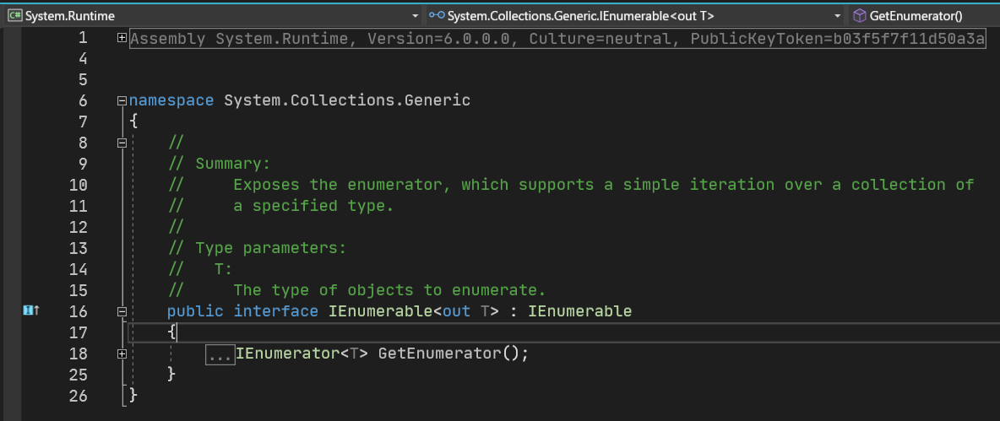
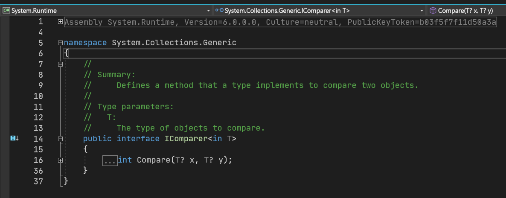
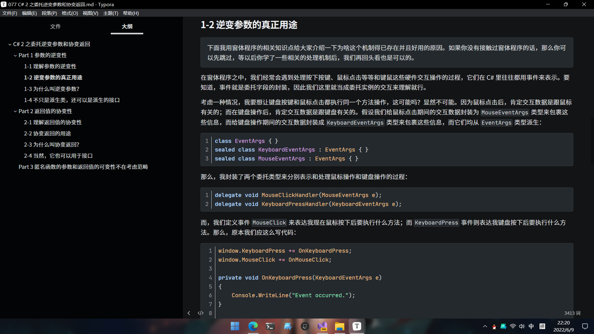

# C# 4 之接口和委托泛型参数的协变性和逆变性

今天我们来说说 C# 4 的第二个新语法特性：关于接口和委托的泛型参数的协变性和逆变性。

这个特性实际上没有专门的词语（或者叫术语词）来说明这个点，所以它的名字特别长，而且也不大好说清楚。

> 本文的协变性和逆变性是一个单独的语法，和 C# 2 里的委托参数逆变性和委托返回值协变性是完全不同的两个语法特性，请注意区分和辨别。

## Part 1 引例

估计各位把协变性和逆变性都忘光了吧。我们今天来举个例子说明一下协变性和逆变性。之前在讲解委托类型参数的逆变性和返回值的协变性的时候，因为它的使用场合并不多，而且再加上即使使用了，用户也不怎么关心它的细节问题，因此总是容易被忘记，所以我猜各位对这两个玩意儿并不是很能明白。今天我们重新举例，因为今天的语法是 C# 4 的。

### 1-1 协变性：`AddRange` 添加一组元素

考虑我们要记录一些宠物信息，我们简单实现了三个类型。

```csharp
abstract class Pet
{
    public abstract string Name { get; }
}
sealed class Dog : Pet
{
    public override string Name { get { return "Dog"; } }
}
sealed class Cat : Pet
{
    public override string Name { get { return "Cat"; } }
}
```

别问，细节我们都没有怎么管，因为只是做演示效果。一会儿 `new Cat()` 了你就把它当成实例化一只猫，而 `new Dog()` 你就当成实例化了一只狗狗就行了。

接着，我们实现一个集合类型，并带有一个 `AddRange` 方法。这个方法的目的是添加一组元素：

```csharp
class Collection<T>
{
    private readonly ICollection<T> _list = new List<T>();

    public void Add(T pet) { _list.Add(pet); }
    public void AddRange(IEnumerable<T> pets)
    {
        foreach (var pet in pets)
            Add(pet);
    }
}
```

也不难理解，对吧。就是包裹了一个 `List<T>` 的元素集合。只是这里的集合我们用接口类型 `ICollection<T>` 接收罢了。问题也不大。

最后，我们在主方法里这么写：

```csharp
var dogs = Enumerable.Repeat(new Dog(), 5);
var collection = new Collection<Pet>();
collection.AddRange(dogs); // Here.
```

你觉得，这样的代码是对的吗？不对，因为细心一点的话会发现问题：`AddRange` 接收类型是 `IEnumerable<Pet>` 的对象，而此时我们的 `dogs` 变量是 `IEnumerable<Dog>` 类型的。这两个类型的泛型参数不同，所以两个类型并不一致，毕竟元素类型不一样怎么能说整体的类型是一样的呢？

那么，按道理来说，这样的代码是不能够通过编译的。但是，C# 4 的魔法允许了这样的代码成立。有人就说，为什么？

我们在 `AddRange` 里使用了这个参数，这个参数是 `IEnumerable<T>` 的类型（当然，这里的例子里 `T` 是 `Pet`，所以这个类型在这个例子里是 `IEnumerable<Pet>`）。而实际上，我们是通过遍历迭代了元素，然后逐个追加到集合之中去的。而仔细一看就会发现，我们在迭代集合、使用集合的期间，`T` 是 `Pet` 对吧。那么这里 `foreach` 循环里，这个 `var pet in pets` 的 `var` 也是 `Pet` 对吧。那么 `Pet` 往 `Pet` 里赋值是合理的。对吗？

很好。再进一步思考一下。现在我把集合改成了 `IEnumerable<Dog>` 之后，那么假如语法成立，`foreach (var pet in pets)` 里的 `pet` 是什么类型的？`Dog`，对吧，因为参数虽然没有变动，但是我们传入的集合是从主方法里拿下来的 `dogs` 变量。`dogs` 变量是 `IEnumerable<Dog>` 类型的，所以如果语法正确的话，这里的 `var` 就是 `Dog`。那么，`Dog` 是 `Pet` 的派生类型，因此 `Add` 方法能否成功执行呢？能。因为 `Add` 方法接收的是一个 `Pet` 类型的参数，而我是 `Dog` 类型的。`Dog` 不是 `Pet` 吗？显然 `Dog` 就是 `Pet` 啊。面向对象最开始我们就说过，派生类型和基类型是一种包含的关系，而派生类型和基类型可以用“什么是什么”来解释。`Dog` 从 `Pet` 类型派生，因此 `Dog` 是 `Pet`，这话没有毛病对吧。

既然逻辑是成立的，我们为什么要限制这种参数传递呢？虽然是集合。因此，C# 4 开始，某种魔法允许了这样的集合传参是成立的。在早期泛型出现的时候，由于泛型的类型是否一致，除了看泛型本身的类型是不是一样的，还要看泛型参数是不是也都是一样的。而泛型，早期被设计为不变的，也就是说，任何时候都无法像是上述这样的代码这样进行集合和集合的“元素兼容性转换”。

这个语法叫什么呢？**泛型参数的协变性**（Co-variance on Generic Arguments）。当然了，刚才就说过这样的语法是一个魔法，也就意味着它必须满足一定条件才可以，并不是什么时候这样的语法都是随意成立的，这就是我们要说的“魔法”的具体原则和原理。这个我们稍后说明。

> 好像，`Cat` 类型实现出来并未在这个例子里用到过。实际上，我这里多写出来是为了给你对比用的。实际上，如果你按照规则重新把序列从 `Dog` 实例改成 `Cat` 实例，一样是成立的。这是用来对照的，只是代码里没有用过这个类型。

而反过来想这个问题，如果语法上不支持这样的赋值的话，那么 C# 的泛型就没有这么灵活了，用起来有些时候也确实不够方便。

### 1-2 逆变性：利用自定义对象比较排序

我们来试着写几个形状类型，这些类型用于获取得到这个对象对应形状的面积。

```csharp
abstract class Shape
{
    public abstract double Area { get; }
}
sealed class Circle : Shape
{
    public int Radius { get; set; }
    public override double Area { get { return Math.PI * Radius * Radius; } }
}
sealed class Rectangle : Shape
{
    public int Width { get; set; }
    public int Height { get; set; }
    public override double Area { get { return Width * Height; } }
}
sealed class Square : Shape
{
    public int Side { get; set; }
    public override double Area { get { return Side * Side; } }
}
```

接着，我们实现一个比较两个 `Shape` 的面积大小的类型，一会儿用于排序。

```csharp
sealed class ShapeAreaComparer : IComparer<Shape>
{
    public int Compare(Shape x, Shape y) { return x.Area.CompareTo(y.Area); }
}
```

也都很好理解。下面我们再来看主方法里的使用。

```csharp
var circles = new[]
{
    new Circle { Radius = 3 },
    new Circle { Radius = 6 },
    new Circle { Radius = 4 }
};

Array.Sort<Circle>(circles, new ShapeAreaComparer());

foreach (var circle in circles)
    Console.WriteLine(string.Format("Radius = {0}, Area = {1}", circle.Radius, circle.Area));
```

你肯定会觉得代码有点毛病。和协变性的例子不同，这个例子多少都觉得会有点别扭。有点别扭很正常。问题出在哪里呢？第 8 行的排序。我们的 `Array.Sort` 方法是一个泛型方法。泛型方法意味着我们在方法上要带泛型参数。一般省略掉是因为泛型参数会自行推断；但是为了这里语法严谨和能够更直观一些，我就把泛型参数写出来了。可问题是，此时泛型参数写出来就出问题了。第二个参数是传入一个自定义比较器。这个比较器是用来排序两个自定义对象的大小的。可问题在于什么呢，在于对象是 `ShapeAreaComparer` 类型的。这个类型的代码写着，它实现的接口类型是 `IComparer<Shape>`（实际上代码里也确实按 `Shape` 来参与的比较）。而 `Array.Sort` 方法的用法，排序用的第二个参数，类型应该是与之匹配的 `IComparer<Circle>` 才对。这里有点别扭的地方就在于，此时的 `Shape` 传入的这个泛型参数的实际类型反而比 `Circle` 这个本应该支持的泛型参数的实际类型要“大”。

这是合理的吗？实际上也是合理的。为什么呢？

假设我们这个 `Array.Sort` 排序用的是冒泡排序法这个老熟人来做的话：

```csharp
static void Sort<T>(T[] array, IComparer<T> comparer)
{
    for (int i = 0; i < array.Length - 1; i++)
    {
        for (int j = 0; j < array.Length - 1 - i; j++)
        {
            if (comparer.Compare(array[j], array[j + 1]) >= 0)
            {
                // Swap.
                var temp = array[j];
                array[j] = array[j + 1];
                array[j + 1] = temp;
            }
        }
    }
}
```

嗯，没毛病。

> 注意我是为了让你更清楚直观理解而说的是假设，实际上不是哈。实际上用的是快速排序。快速排序的代码理解起来比较困难，所以用我们的老熟人，让各位更清楚直观地感受到比较两个实例大小关系的代码。

注意到第 7 行代码，我们可以发现，这里的 `comparer` 对象发挥了它的作用：比较两个对象的大小关系。如果两个对象的比较结果 `>= 0`，就说明前面比后面大，或者两个对象一样大。因为泛型参数 `T` 是随便啥类型都可以，所以这个类型并不直接包含比较大小的方法在里面。因此你直接对两个 `T` 使用 `CompareTo` 之类的方法，或者是大小于运算符的话，是肯定不可以的。为了解决这个问题，我们才想到了用比较器对象来做。

那么，回头来看排序方法。我们传入的比较器是 `ShapeAreaComparer` 类型的，它兼容的类型实例是 `Shape` 类型的。而我们要求比较大小的实例类型要宽泛。原来接收的是 `Circle` 类型的实例，这里要求的是 `Shape` 类型的实例。你说，这样传参合适吗？仍然是合适的。 正因为 `Shape` 类型比 `Circle` 要宽，所以传参进去之后会做一次隐式转换，或者换句话说 `Circle` 可以使用转化为 `Shape` 的多态原则，再或者说，`Shape` 类型因为派生出了 `Circle`，所以类型上是兼容的。

反正不管怎么说吧，这种肯定是正确的传参过程，因此编译器并不应该禁止掉这样的赋值。而这也是针对于泛型参数的语法，所以早期仍然是不允许的。从 C# 4 开始，这种魔法允许了这样的过程成立。于是，你可以对一个 `Circle` 类型使用这个看起来不太合理但正确的语法了。

这种语法称为**泛型参数的逆变性**（Contra-variance on Generic Arguments）。和前文一样，它也依赖于某种魔法才可以成立，并不是随意两个泛型类型参数不同都可以成立的。

## Part 2 探讨“魔法”：满足前文协变和逆变性的条件

前文两个例子使得我们可以成功使用这样的看起来不合规但逻辑合理的语法来完成我们想要的操作。那么，我之前说它们是魔法，那么这样的魔法是怎么做的呢？到底什么样的赋值过程，满足什么样的条件，前文的代码才可以真正正确、严谨和正常呢？

请仔细对比前面两个引例，有什么相似之处，你发现了吗？对了。这两个类型都是带入了一个方法来产生了协变性和逆变性的过程，而这个方法产生这个过程的点，恰好都在于一个泛型接口类型上。比如第一个例子，`AddRange` 的实现要求传参是 `IEnumerable<T>` 接口类型，它是泛型的；而第二个例子，排序方法 `Sort` 要求的第二个参数类型 `IComparer<T>` 也是接口类型，也是泛型的。

那么，我们就在这个泛型接口上找“魔法”。分别打开 `IEnumerable<T>` 和 `IComparer<T>` 的元数据，你会发现魔法显现了出来：





泛型参数 `T` 上竟标了两个关键字！其中 `IEnumerable<T>` 是标的 `out`，而 `IComparer<T>` 上标的是 `in`。

> 之前说过一次，不过各位可能已经忘掉了。这里的元数据里，`T` 上面有个问号标记。这个语法是 C# 9 才有的，称为泛型参数在没有任何约束情况下表示它可为 `null` 的标记。换句话说，这两个参数 `T` 都是允许 `null` 接收的（当然，前提是这个 `T` 是一个支持 `null` 作为取值的类型，比如可空值类型和引用类型）。在 C# 8 以前（比如现在我们讲解教程期间），是不是 `null` 是无法从语法上表达出来的。当然，这里要把可空值类型给排除在外，因为它用的就是这个 `?` 标记。不过，在引用类型里，因为引用类型的默认数值就是 `null`，所以它在任何时候都是可能包含 `null` 值的，因此养成习惯会经常在方法执行的刚开始对所有的引用类型进行判空操作（比如写一句 `if (obj == null) throw new ArgumentNullException()` 这样的语法，或者是把 `obj == null` 改成 `ReferenceEquals(obj, null)` 之类的。
>
> 不过，这里不是给各位扯这个语法的，因为它就目前的介绍内容来说已经超纲了，所以就不再继续详述这个点的内容。在 C# 9 以前，这个问号标记 `?` 你直接当它不存在就可以了，不会影响代码的执行和理解。

啊这……这俩关键字有什么讲究吗？接下来就来说说，泛型参数上的 `out` 和 `in` 关键字。

### 2-1 泛型参数的可变性标记符

用于泛型参数上的 `in` 和 `out` 关键字称为**可变性标记符**。别问，我也不知道英语是啥，因为这个词是我自己为了好介绍所以自创的。可变性指的是协变性和逆变性，它俩因为传参过程之中，泛型参数的实际类型会产生变化，所以称为可变性；标记符就不用多说了。而其中：

* `in` 关键字：泛型参数支持逆变性；
* `out` 关键字：泛型参数支持协变性。

只有这两个关键字要使用到，而且这个规则是永远成立的，因此你可以背下来。但是我不建议你背，因为容易混淆，特别是刚学的时候分不清楚的时候，容易记混，别问我为啥知道这些，我也是这么过来的。

下面说说，关键字为啥非得用 `in` 和 `out` 这两个单词，而不是别的单词，以及实现规则和原理，为啥可以这么写。

### 2-2 可变性标记符只能用于接口和委托的泛型参数上

第一个要注意的点是，`in` 和 `out` 只能写在接口和委托类型里的泛型参数（如果它有泛型参数的话）上面，其它类型不行。比如自己定义的类类型 `Collection<T>` 里，`T` 是不能写 `in` 或者 `out` 的。当然，泛型结构也不行。说了只能是接口和委托了。

为啥呢？因为只有委托和接口才广泛具有“传参转换”的用法。众所周知，我们目前学到过的自定义类型语法有五种：

* 结构（`struct`）
* 类（`class`）
* 委托（`delegate`）
* 接口（`interface`）
* 枚举（`enum`）

其中，只有前四种支持泛型，枚举不支持泛型（枚举自己都是值类型，都直接和整数进行转换了，还要它成泛型干嘛）。于是，就还剩下四种：

* 泛型结构
* 泛型类
* 泛型委托
* 泛型接口

其中，结构是不能自定义派生和继承关系的，它们默认走 `ValueType` 类型派生；而类则是可以定义派生和继承关系。但是，C# 的面向对象的体系限制了派生关系必须是一个类型如果有自定义的基类型的话，只能有一个。因此，它还是相当于从“这棵树”上一条龙下来的部分，因此也不够通用。

所以，只剩下两个类型了：

* 泛型委托
* 泛型接口

这两个类型具有广泛的使用。任何类型都可以实现接口，不管你是值类型还是引用类型；而且接口自己还可以从接口派生得到。所以接口从这个角度来说，使用特别广泛；另外，委托从 C# 1 就有，当时，我们是使用方法名称当参数传递进去进行实例化委托的实例的；而到了 C# 2 和 3 开始支持匿名函数和 lambda 表达式之后，事情就变得有趣了起来：由于广泛推崇使用匿名函数和 lambda 表达式，因此这样的调用过程越来越多样化；而在 LINQ 里，我们知道关键字语法会被转换为方法调用，而方法调用的参数也都是一个一个的委托类型实例，因此传入的关键字写法的操作也都会被处理为合适的 lambda 表达式。所以 LINQ 里对委托的使用也可以算进来。

正是因为这样的原因，接口和委托才具备这种可变性的使用条件：因为它们才是真正的灵活变化的类型。因此，C# 4 对这两种类型支持了泛型参数的可变性。

> 再严谨一点的话。泛型类类型的泛型参数不支持可变性，其实还有别的原因。因为泛型类类型的泛型参数并不会使用成前文这样的调用，所以对类类型支持这样的语法，是不太能够体现出转换的意义所在的。

### 2-3 满足协变性和逆变性的真正条件

要想正确使用上述关键字，不是随便怎么写都行的。要真是我就加一个关键字到泛型参数上去就行的话，仍然不能体现出语法的严谨，以及转换的严谨。

还记得 C# 2 的委托参数逆变和返回值协变吗？这个特性里至少都约定了参数是支持逆变性，而返回值支持协变性的规则。意思就是说，因为返回值支持的是协变性，因此你不能生搬硬套让返回值支持逆变性；反过来，参数也不能用协变性。这是从语法上限制的。

还记得原因吗？为什么参数支持的是逆变性，而返回值支持的是协变性？我们使用动漫《夏日重现》和《只有我不在的城市》的时间回溯技能，回到那一讲的内容去！

唰~



呃，不中二病了。说说原因吧。因为参数体现的效果是“抽象提取”。基类型和子类型来对比的话，显然基类型包含的东西，子类型应该都有，因为这是派生关系，是面向对象里的一大基本特性。

那么，基类型里既然都有的话，那我写进参数里去，基类型能使，那么子类型也能使：到时候调用的时候，就即使是支持子类型的成员，也仍然是支持的，因为子类型确实包含它们。所以，这种限制是没有意义和必要的，于是 C# 2 就放开了限制。

而对于今天的例子，逻辑其实是类似的。因为我们在使用参数的时候，参数传入的内容即使是基类型的实例，但基类型的东西子类型它都有啊。你想想刚才的 `IComparer<>` 接口实现的自定义比较器类型。那个类型我们就只需要用到 `Area` 属性比较大小。而这个属性 `Shape` 里就有。所以我基类型就有的东西，子类型自然也有。所以，我们压根不需要用子类型 `Circle` 这种更精确的类型进行判断，而是直接拿出它的基类型的判断规则来判断就 OK。这也是逆变性的基本思想，因此，**泛型参数的逆变性，表示的是泛型参数的实际类型用于参数的时候**。这句话有点绕，注意区分两个“参数”的概念：泛型参数的参数说的是泛型类型 `T` 的是基类型，而第二个参数说的是方法里的实际传参。

而正是因为这个原因，我们才把泛型参数用 `in` 进行修饰。原因就在于，它是用来当方法参数的，方法参数是“传入”，那不就是 pass into 的这个 in 吗？所以，要想泛型参数支持逆变性，那么标记的关键字是 `in`。

协变性呢？对咯，**泛型参数的实际类型用于返回值的时候**。返回值的使用场景是将数据反馈给外界使用的这么一种存在。考虑前文的 `IEnumerable<>` 接口类型的例子，它的返回值体现在哪里呢？`foreach` 循环的迭代变量上。因为这个接口里包含了一个 `IEnumerator<>` 接口作返回值的 `GetEnumerator` 的无参方法。这个方法的返回值是一个迭代器对象，但实际上，只要支持这个方法我们就可以使用 `foreach` 循环；而反过来说也成立：能使用 `foreach` 循环的话，那么这个类型是肯定包含 `GetEnumerator` 的无参方法的。

所以说，它俩是相辅相成的存在。所以我们说这个接口的使用和返回值，体现在了 `foreach` 循环上。`foreach` 循环迭代对象的类型，应该是 `IEnumerable<T>` 接口类型的泛型参数 `T` 这个类型。而这个类型在我们使用过程之中是将其追加到集合 `_list` 里。这个集合是 `T` 类型作为元素的存在。那么，如果我这个 `T` 类型如果是一个范围宽泛的基类型的话，那么我即使传入子类型，也是可以兼容和传入进去的，因为会有一次隐式的转换过程。而这个过程，用的是 `foreach` 的迭代变量，是这个 `IEnumerable<>` 迭代过程的返回值结果来进行迭代的。

详细一点的话，我们可以完整把 `foreach` 写成 `while` 循环的方式：

```csharp
var enumerator = pets.GetEnumerator();
while (enumerator.MoveNext())
    _list.Add(enumerator.Current);
```

这里的 `Current` 属性就是使用了 `enumerator` 这个返回值的核心所在。它类型较小，所以传入 `Add` 方法需要的参数类型较大的情况，才会成立；因为较小传入给较大的地方使用才会正确发生隐式转换，是安全的转换。反过来肯定就不对了：较大类型传入给较小的地方，就好比你一个大胖子走小路，然后卡在路中间了一样的道理。

所以，这么使用结果，是合理的。它的过程，也是正常的小转大的过程，所以是协变性。因此，整个对比来看，**泛型参数的协变性，表示的是泛型参数的实际类型用于返回值的时候**。正是因为这个原因，它是“返回出去给外界”的过程，所以是 return outside 的这个 out 单词。因此，协变性用的是 `out` 关键字来修饰泛型参数。

那么，总结一下：

* 泛型参数的协变性用 `out` 关键字修饰，用于实际类型**只**用在返回值上的情况；
* 泛型参数的逆变性用 `in` 关键字修饰，用于实际类型**只**用在参数上的情况。

所以，再次回到开头查看两个类型的元数据就可以发现，确实是满足的：


你看，`IEnumerable<out T>` 的这个 `T` 是不是在接口类型里只用在了返回值上？而再次看 `IComparer<in T>` 的 `T` 是不是只用在了参数上？

记住了吗？

### 2-4 最后顺带一提

前文介绍都是按泛型接口来说的，因为它比较好举例子。但是，这个语法支持的范围不只是泛型接口，还可以是泛型委托。所以不要忘了这一点。

不过，是泛型委托的时候要注意，它和 C# 2 里的参数逆变性和返回值协变性是两种完全不同的可变性语法特性，一定要注意区分：C# 2 的语法不依赖于泛型参数，任何时候都可以，只要它是委托类型就 OK；而 C# 4 的这个语法是针对于泛型参数来说的。

## Part 3 .NET 库里的类型有哪些支持了这个呢？

实际上有很多。列个表给大家看看。

| 类型                                                         | 泛型参数的协变性支持情况 | 泛型参数的逆变性支持情况 |
| :----------------------------------------------------------- | :----------------------- | :----------------------- |
| [Action<>](https://docs.microsoft.com/en-us/dotnet/api/system.action-1) 系列 | ❌                        | ⭕                        |
| [Comparison<>](https://docs.microsoft.com/en-us/dotnet/api/system.comparison-1) | ❌                        | ⭕                        |
| [Converter<,>](https://docs.microsoft.com/en-us/dotnet/api/system.converter-2) | ⭕                        | ⭕                        |
| [Func<>](https://docs.microsoft.com/en-us/dotnet/api/system.func-1) 单泛型参数 | ⭕                        | ❌                        |
| [Func<,>](https://docs.microsoft.com/en-us/dotnet/api/system.func-2) 系列（剩下的） | ⭕                        | ⭕                        |
| [IComparable<>](https://docs.microsoft.com/en-us/dotnet/api/system.icomparable-1) | ❌                        | ⭕                        |
| [Predicate<>](https://docs.microsoft.com/en-us/dotnet/api/system.predicate-1) | ❌                        | ⭕                        |
| [IComparer<>](https://docs.microsoft.com/en-us/dotnet/api/system.collections.generic.icomparer-1) | ❌                        | ⭕                        |
| [IEnumerable<>](https://docs.microsoft.com/en-us/dotnet/api/system.collections.generic.ienumerable-1) | ⭕                        | ❌                        |
| [IEnumerator<>](https://docs.microsoft.com/en-us/dotnet/api/system.collections.generic.ienumerator-1) | ⭕                        | ❌                        |
| [IEqualityComparer<>](https://docs.microsoft.com/en-us/dotnet/api/system.collections.generic.iequalitycomparer-1) | ❌                        | ⭕                        |
| [IGrouping<,>](https://docs.microsoft.com/en-us/dotnet/api/system.linq.igrouping-2) | ⭕                        | ❌                        |
| [IOrderedEnumerable<>](https://docs.microsoft.com/en-us/dotnet/api/system.linq.iorderedenumerable-1) | ⭕                        | ❌                        |
| [IOrderedQueryable<>](https://docs.microsoft.com/en-us/dotnet/api/system.linq.iorderedqueryable-1) | ⭕                        | ❌                        |
| [IQueryable<>](https://docs.microsoft.com/en-us/dotnet/api/system.linq.iqueryable-1) | ⭕                        | ❌                        |

这个表在 C# 的[官方文档](https://docs.microsoft.com/en-us/dotnet/standard/generics/covariance-and-contravariance)里有列举出来。就不多展开说明了。如果对于库 API 不是很熟悉的小伙伴，自己看元数据去吧。

至此，我们就把这个语法给大家说明清楚了。下一讲是 C# 4 里的最后一个语法：可选和命名参数。它的内容比较容易去说明，所以内容不多，C# 4 就结束了，然后是 C# 5。